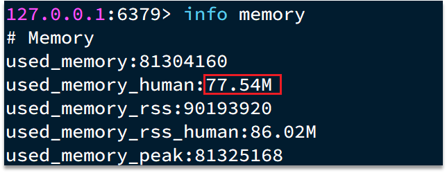
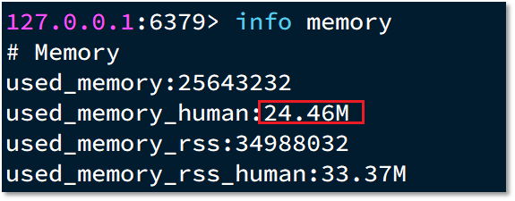
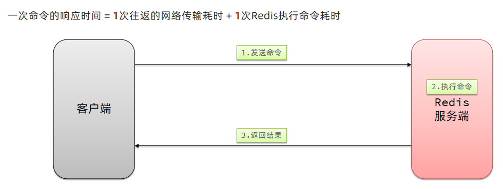
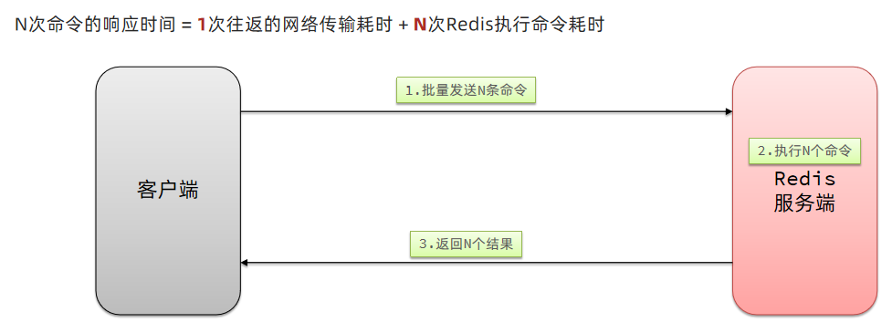
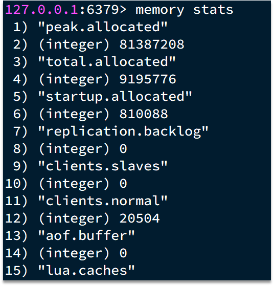

# 05-最佳实践

- [1、Redis键值设计](#1redis键值设计)
  - [1.1、优雅的key结构](#11优雅的key结构)
  - [1.2、拒绝BigKey](#12拒绝bigkey)
    - [1.2.1、BigKey的危害](#121bigkey的危害)
    - [1.2.2、如何发现BigKey](#122如何发现bigkey)
    - [1.2.3、如何删除BigKey](#123如何删除bigkey)
  - [1.3、恰当的数据类型](#13恰当的数据类型)
  - [1.4、总结](#14总结)
- [2、批处理优化](#2批处理优化)
  - [2.1、Pipeline](#21pipeline)
  - [2.2、集群下的批处理](#22集群下的批处理)
- [3、服务器端优化-持久化配置](#3服务器端优化-持久化配置)
- [4、服务器端优化-慢查询优化](#4服务器端优化-慢查询优化)
  - [4.1 什么是慢查询](#41-什么是慢查询)
  - [4.2 如何查看慢查询](#42-如何查看慢查询)
- [5、服务器端优化-命令及安全配置](#5服务器端优化-命令及安全配置)
- [6、服务器端优化-Redis内存划分和内存配置](#6服务器端优化-redis内存划分和内存配置)
- [7、服务器端集群优化-集群还是主从](#7服务器端集群优化-集群还是主从)


## 1、Redis键值设计

### 1.1、优雅的key结构

Redis的Key虽然可以自定义，但最好遵循下面的几个最佳实践约定：

- 遵循基本格式：[业务名称]:[数据名]:[id]
- 长度不超过44字节
- 不包含特殊字符

例如：我们的登录业务，保存用户信息，其key可以设计成如下格式：


这样设计的好处：

- 可读性强
- 避免key冲突
- 方便管理
- 更节省内存： key是string类型，底层编码包含int、embstr和raw三种。embstr在小于44字节使用，采用连续内存空间，内存占用更小。当字节数大于44字节时，会转为raw模式存储，在raw模式下，内存空间不是连续的，而是采用一个指针指向了另外一段内存空间，在这段空间里存储SDS内容，这样空间不连续，访问的时候性能也就会收到影响，还有可能产生内存碎片


### 1.2、拒绝BigKey

BigKey通常以Key的大小和Key中成员的数量来综合判定，例如：

- Key本身的数据量过大：一个String类型的Key，它的值为5 MB
- Key中的成员数过多：一个ZSET类型的Key，它的成员数量为10,000个
- Key中成员的数据量过大：一个Hash类型的Key，它的成员数量虽然只有1,000个但这些成员的Value（值）总大小为100 MB

那么如何判断元素的大小呢？redis也给我们提供了命令


推荐值：

- 单个key的value小于10KB
- 对于集合类型的key，建议元素数量小于1000

#### 1.2.1、BigKey的危害

- 网络阻塞
  - 对BigKey执行读请求时，少量的QPS就可能导致带宽使用率被占满，导致Redis实例，乃至所在物理机变慢
- 数据倾斜
  - BigKey所在的Redis实例内存使用率远超其他实例，无法使数据分片的内存资源达到均衡
- Redis阻塞
  - 对元素较多的hash、list、zset等做运算会耗时较旧，使主线程被阻塞
- CPU压力
  - 对BigKey的数据序列化和反序列化会导致CPU的使用率飙升，影响Redis实例和本机其它应用

#### 1.2.2、如何发现BigKey

##### ①redis-cli --bigkeys

利用redis-cli提供的--bigkeys参数，可以遍历分析所有key，并返回Key的整体统计信息与每个数据的Top1的big key

命令：`redis-cli -a 密码 --bigkeys`


##### ②scan扫描

自己编程，利用scan扫描Redis中的所有key，利用strlen、hlen等命令判断key的长度（此处不建议使用MEMORY USAGE）


scan 命令调用完后每次会返回2个元素，第一个是下一次迭代的光标，第一次光标会设置为0，当最后一次scan 返回的光标等于0时，表示整个scan遍历结束了，第二个返回的是List，一个匹配的key的数组

```java
import com.redis.jedis.util.JedisConnectionFactory;
import org.junit.jupiter.api.AfterEach;
import org.junit.jupiter.api.BeforeEach;
import org.junit.jupiter.api.Test;
import redis.clients.jedis.Jedis;
import redis.clients.jedis.ScanResult;

import java.util.HashMap;
import java.util.List;
import java.util.Map;

public class JedisTest {
    private Jedis jedis;

    @BeforeEach
    void setUp() {
        // 1.建立连接
        // jedis = new Jedis("192.168.150.101", 6379);
        jedis = JedisConnectionFactory.getJedis();
        // 2.设置密码
        jedis.auth("123321");
        // 3.选择库
        jedis.select(0);
    }

    final static int STR_MAX_LEN = 10 * 1024;
    final static int HASH_MAX_LEN = 500;

    @Test
    void testScan() {
        int maxLen = 0;
        long len = 0;

        String cursor = "0";
        do {
            // 扫描并获取一部分key
            ScanResult<String> result = jedis.scan(cursor);
            // 记录cursor
            cursor = result.getCursor();
            List<String> list = result.getResult();
            if (list == null || list.isEmpty()) {
                break;
            }
            // 遍历
            for (String key : list) {
                // 判断key的类型
                String type = jedis.type(key);
                switch (type) {
                    case "string":
                        len = jedis.strlen(key);
                        maxLen = STR_MAX_LEN;
                        break;
                    case "hash":
                        len = jedis.hlen(key);
                        maxLen = HASH_MAX_LEN;
                        break;
                    case "list":
                        len = jedis.llen(key);
                        maxLen = HASH_MAX_LEN;
                        break;
                    case "set":
                        len = jedis.scard(key);
                        maxLen = HASH_MAX_LEN;
                        break;
                    case "zset":
                        len = jedis.zcard(key);
                        maxLen = HASH_MAX_LEN;
                        break;
                    default:
                        break;
                }
                if (len >= maxLen) {
                    System.out.printf("Found big key : %s, type: %s, length or size: %d %n", key, type, len);
                }
            }
        } while (!cursor.equals("0"));
    }
    
    @AfterEach
    void tearDown() {
        if (jedis != null) {
            jedis.close();
        }
    }

}
```

##### ③第三方工具

- 利用第三方工具，如 Redis-Rdb-Tools 分析RDB快照文件，全面分析内存使用情况
- https://github.com/sripathikrishnan/redis-rdb-tools

##### ④网络监控

- 自定义工具，监控进出Redis的网络数据，超出预警值时主动告警
- 一般阿里云搭建的云服务器就有相关监控页面


#### 1.2.3、如何删除BigKey

BigKey内存占用较多，即便时删除这样的key也需要耗费很长时间，导致Redis主线程阻塞，引发一系列问题。

- redis 3.0 及以下版本
  - 如果是集合类型，则遍历BigKey的元素，先逐个删除子元素，最后删除BigKey


- Redis 4.0以后
  - Redis在4.0后提供了异步删除的命令：unlink

### 1.3、恰当的数据类型

#### 例1：比如存储一个User对象，我们有三种存储方式：

##### ①方式一：json字符串

| user:1 | {"name": "Jack", "age": 21} |
| :----: | :-------------------------: |

优点：实现简单粗暴

缺点：数据耦合，不够灵活

##### ②方式二：字段打散

| user:1:name | Jack |
| :---------: | :--: |
| user:1:age  |  21  |

优点：可以灵活访问对象任意字段

缺点：占用空间大、没办法做统一控制

##### ③方式三：hash（推荐）

<table>
	<tr>
		<td rowspan="2">user:1</td>
        <td>name</td>
        <td>jack</td>
	</tr>
	<tr>
		<td>age</td>
		<td>21</td>
	</tr>
</table>

优点：底层使用ziplist，空间占用小，可以灵活访问对象的任意字段

缺点：代码相对复杂

#### 例2：假如有hash类型的key，其中有100万对field和value，field是自增id，这个key存在什么问题？如何优化？

<table>
	<tr style="color:red">
		<td>key</td>
        <td>field</td>
        <td>value</td>
	</tr>
	<tr>
		<td rowspan="3">someKey</td>
		<td>id:0</td>
        <td>value0</td>
	</tr>
    <tr>
		<td>.....</td>
        <td>.....</td>
	</tr>
    <tr>
        <td>id:999999</td>
        <td>value999999</td>
    </tr>
</table>

存在的问题：

- hash的entry数量超过500时，会使用哈希表而不是ZipList，内存占用较多
  - 
- 可以通过hash-max-ziplist-entries配置entry上限。但是如果entry过多就会导致BigKey问题

##### 方案一

拆分为string类型

<table>
	<tr style="color:red">
		<td>key</td>
        <td>value</td>
	</tr>
	<tr>
		<td>id:0</td>
        <td>value0</td>
	</tr>
    <tr>
		<td>.....</td>
        <td>.....</td>
	</tr>
    <tr>
        <td>id:999999</td>
        <td>value999999</td>
    </tr>
</table>

存在的问题：

- string结构底层没有太多内存优化，内存占用较多



- 想要批量获取这些数据比较麻烦

##### 方案二

拆分为小的hash，将 id / 100 作为key， 将id % 100 作为field，这样每100个元素为一个Hash

<table>
	<tr style="color:red">
		<td>key</td>
        <td>field</td>
        <td>value</td>
	</tr>
	<tr>
        <td rowspan="3">key:0</td>
		<td>id:00</td>
        <td>value0</td>
	</tr>
    <tr>
		<td>.....</td>
        <td>.....</td>
	</tr>
    <tr>
        <td>id:99</td>
        <td>value99</td>
    </tr>
    <tr>
        <td rowspan="3">key:1</td>
		<td>id:00</td>
        <td>value100</td>
	</tr>
    <tr>
		<td>.....</td>
        <td>.....</td>
	</tr>
    <tr>
        <td>id:99</td>
        <td>value199</td>
    </tr>
    <tr>
    	<td colspan="3">....</td>
    </tr>
    <tr>
        <td rowspan="3">key:9999</td>
		<td>id:00</td>
        <td>value999900</td>
	</tr>
    <tr>
		<td>.....</td>
        <td>.....</td>
	</tr>
    <tr>
        <td>id:99</td>
        <td>value999999</td>
    </tr>
</table>



```java
package com.redis.test;

import com.redis.jedis.util.JedisConnectionFactory;
import org.junit.jupiter.api.AfterEach;
import org.junit.jupiter.api.BeforeEach;
import org.junit.jupiter.api.Test;
import redis.clients.jedis.Jedis;
import redis.clients.jedis.Pipeline;
import redis.clients.jedis.ScanResult;

import java.util.HashMap;
import java.util.List;
import java.util.Map;

public class JedisTest {
    private Jedis jedis;

    @BeforeEach
    void setUp() {
        // 1.建立连接
        // jedis = new Jedis("192.168.150.101", 6379);
        jedis = JedisConnectionFactory.getJedis();
        // 2.设置密码
        jedis.auth("123321");
        // 3.选择库
        jedis.select(0);
    }

    @Test
    void testSetBigKey() {
        Map<String, String> map = new HashMap<>();
        for (int i = 1; i <= 650; i++) {
            map.put("hello_" + i, "world!");
        }
        jedis.hmset("m2", map);
    }

    @Test
    void testBigHash() {
        Map<String, String> map = new HashMap<>();
        for (int i = 1; i <= 100000; i++) {
            map.put("key_" + i, "value_" + i);
        }
        jedis.hmset("test:big:hash", map);
    }

    @Test
    void testBigString() {
        for (int i = 1; i <= 100000; i++) {
            jedis.set("test:str:key_" + i, "value_" + i);
        }
    }

    @Test
    void testSmallHash() {
        int hashSize = 100;
        Map<String, String> map = new HashMap<>(hashSize);
        for (int i = 1; i <= 100000; i++) {
            int k = (i - 1) / hashSize;
            int v = i % hashSize;
            map.put("key_" + v, "value_" + v);
            if (v == 0) {
                jedis.hmset("test:small:hash_" + k, map);
            }
        }
    }

    @AfterEach
    void tearDown() {
        if (jedis != null) {
            jedis.close();
        }
    }
}
```

### 1.4、总结

- Key的最佳实践
  - 固定格式：[业务名]:[数据名]:[id]
  - 足够简短：不超过44字节
  - 不包含特殊字符
- Value的最佳实践：
  - 合理的拆分数据，拒绝BigKey
  - 选择合适数据结构
  - Hash结构的entry数量不要超过1000
  - 设置合理的超时时间

## 2、批处理优化

### 2.1、Pipeline

#### 2.1.1、我们的客户端与redis服务器是这样交互的

单个命令的执行流程



N条命令的执行流程


redis处理指令是很快的，主要花费的时候在于网络传输。于是乎很容易想到将多条指令批量的传输给redis



#### 2.1.2、MSet

Redis提供了很多Mxxx这样的命令，可以实现批量插入数据，例如：

- mset
- hmset

利用mset批量插入10万条数据

```java
@Test
void testMxx() {
    String[] arr = new String[2000];
    int j;
    long b = System.currentTimeMillis();
    for (int i = 1; i <= 100000; i++) {
        j = (i % 1000) << 1;
        arr[j] = "test:key_" + i;
        arr[j + 1] = "value_" + i;
        if (j == 0) {
            jedis.mset(arr);
        }
    }
    long e = System.currentTimeMillis();
    System.out.println("time: " + (e - b));
}
```

#### 2.1.3、Pipeline

MSET虽然可以批处理，但是却只能操作部分数据类型，因此如果有对复杂数据类型的批处理需要，建议使用Pipeline

```java
@Test
void testPipeline() {
    // 创建管道
    Pipeline pipeline = jedis.pipelined();
    long b = System.currentTimeMillis();
    for (int i = 1; i <= 100000; i++) {
        // 放入命令到管道
        pipeline.set("test:key_" + i, "value_" + i);
        if (i % 1000 == 0) {
            // 每放入1000条命令，批量执行
            pipeline.sync();
        }
    }
    long e = System.currentTimeMillis();
    System.out.println("time: " + (e - b));
}
```

### 2.2、集群下的批处理

如MSET或Pipeline这样的批处理需要在一次请求中携带多条命令，而此时如果Redis是一个集群，那批处理命令的多个key必须落在一个插槽中，否则就会导致执行失败。大家可以想一想这样的要求其实很难实现，因为我们在批处理时，可能一次要插入很多条数据，这些数据很有可能不会都落在相同的节点上，这就会导致报错了

这个时候，我们可以找到4种解决方案


第一种方案：串行执行，所以这种方式没有什么意义，当然，执行起来就很简单了，缺点就是耗时过久。

第二种方案：串行slot，简单来说，就是执行前，客户端先计算一下对应的key的slot，一样slot的key就放到一个组里边，不同的，就放到不同的组里边，然后对每个组执行pipeline的批处理，他就能串行执行各个组的命令，这种做法比第一种方法耗时要少，但是缺点呢，相对来说复杂一点，所以这种方案还需要优化一下

第三种方案：并行slot，相较于第二种方案，在分组完成后串行执行，第三种方案，就变成了并行执行各个命令，所以他的耗时就非常短，但是实现呢，也更加复杂。

第四种：hash_tag，redis计算key的slot的时候，其实是根据key的有效部分来计算的，通过这种方式就能一次处理所有的key，这种方式耗时最短，实现也简单，但是如果通过操作key的有效部分，那么就会导致所有的key都落在一个节点上，产生数据倾斜的问题，所以我们推荐使用第三种方式。

#### 2.2.1 串行化执行代码实践

```java
public class JedisClusterTest {

    private JedisCluster jedisCluster;

    @BeforeEach
    void setUp() {
        // 配置连接池
        JedisPoolConfig poolConfig = new JedisPoolConfig();
        poolConfig.setMaxTotal(8);
        poolConfig.setMaxIdle(8);
        poolConfig.setMinIdle(0);
        poolConfig.setMaxWaitMillis(1000);
        HashSet<HostAndPort> nodes = new HashSet<>();
        nodes.add(new HostAndPort("192.168.150.101", 7001));
        nodes.add(new HostAndPort("192.168.150.101", 7002));
        nodes.add(new HostAndPort("192.168.150.101", 7003));
        nodes.add(new HostAndPort("192.168.150.101", 8001));
        nodes.add(new HostAndPort("192.168.150.101", 8002));
        nodes.add(new HostAndPort("192.168.150.101", 8003));
        jedisCluster = new JedisCluster(nodes, poolConfig);
    }

    @Test
    void testMSet() {
        jedisCluster.mset("name", "Jack", "age", "21", "sex", "male");

    }

    @Test
    void testMSet2() {
        Map<String, String> map = new HashMap<>(3);
        map.put("name", "Jack");
        map.put("age", "21");
        map.put("sex", "Male");
        //对Map数据进行分组。根据相同的slot放在一个分组
        //key就是slot，value就是一个组
        Map<Integer, List<Map.Entry<String, String>>> result = map.entrySet()
                .stream()
                .collect(Collectors.groupingBy(
                        entry -> ClusterSlotHashUtil.calculateSlot(entry.getKey()))
                );
        //串行的去执行mset的逻辑
        for (List<Map.Entry<String, String>> list : result.values()) {
            String[] arr = new String[list.size() * 2];
            int j = 0;
            for (int i = 0; i < list.size(); i++) {
                j = i<<2;
                Map.Entry<String, String> e = list.get(0);
                arr[j] = e.getKey();
                arr[j + 1] = e.getValue();
            }
            jedisCluster.mset(arr);
        }
    }

    @AfterEach
    void tearDown() {
        if (jedisCluster != null) {
            jedisCluster.close();
        }
    }
}
```

2.2.2 Spring集群环境下批处理代码

```java
   @Test
    void testMSetInCluster() {
        Map<String, String> map = new HashMap<>(3);
        map.put("name", "Rose");
        map.put("age", "21");
        map.put("sex", "Female");
        stringRedisTemplate.opsForValue().multiSet(map);


        List<String> strings = stringRedisTemplate.opsForValue().multiGet(Arrays.asList("name", "age", "sex"));
        strings.forEach(System.out::println);

    }
```

**原理分析**

在RedisAdvancedClusterAsyncCommandsImpl 类中

首先根据slotHash算出来一个partitioned的map，map中的key就是slot，而他的value就是对应的对应相同slot的key对应的数据

通过 RedisFuture<String> mset = super.mset(op);进行异步的消息发送

```Java
@Override
public RedisFuture<String> mset(Map<K, V> map) {

    Map<Integer, List<K>> partitioned = SlotHash.partition(codec, map.keySet());

    if (partitioned.size() < 2) {
        return super.mset(map);
    }

    Map<Integer, RedisFuture<String>> executions = new HashMap<>();

    for (Map.Entry<Integer, List<K>> entry : partitioned.entrySet()) {

        Map<K, V> op = new HashMap<>();
        entry.getValue().forEach(k -> op.put(k, map.get(k)));

        RedisFuture<String> mset = super.mset(op);
        executions.put(entry.getKey(), mset);
    }

    return MultiNodeExecution.firstOfAsync(executions);
}
```

## 3、服务器端优化-持久化配置

Redis的持久化虽然可以保证数据安全，但也会带来很多额外的开销，因此持久化请遵循下列建议：

* 用来做缓存的Redis实例尽量不要开启持久化功能
* 建议关闭RDB持久化功能，使用AOF持久化
* 利用脚本定期在slave节点做RDB，实现数据备份
* 设置合理的rewrite阈值，避免频繁的bgrewrite
* 配置no-appendfsync-on-rewrite = yes，禁止在rewrite期间做aof，避免因AOF引起的阻塞
* 部署有关建议：
  * Redis实例的物理机要预留足够内存，应对fork和rewrite
  * 单个Redis实例内存上限不要太大，例如4G或8G。可以加快fork的速度、减少主从同步、数据迁移压力
  * 不要与CPU密集型应用部署在一起
  * 不要与高硬盘负载应用一起部署。例如：数据库、消息队列

## 4、服务器端优化-慢查询优化

### 4.1 什么是慢查询

并不是很慢的查询才是慢查询，而是：在Redis执行时耗时超过某个阈值的命令，称为慢查询。

慢查询的危害：由于Redis是单线程的，所以当客户端发出指令后，他们都会进入到redis底层的queue来执行，如果此时有一些慢查询的数据，就会导致大量请求阻塞，从而引起报错，所以我们需要解决慢查询问题。


慢查询的阈值可以通过配置指定：

slowlog-log-slower-than：慢查询阈值，单位是微秒。默认是10000，建议1000

慢查询会被放入慢查询日志中，日志的长度有上限，可以通过配置指定：

slowlog-max-len：慢查询日志（本质是一个队列）的长度。默认是128，建议1000


修改这两个配置可以使用：config set命令：


### 4.2 如何查看慢查询

知道了以上内容之后，那么咱们如何去查看慢查询日志列表呢：

* slowlog len：查询慢查询日志长度
* slowlog get [n]：读取n条慢查询日志
* slowlog reset：清空慢查询列表


## 5、服务器端优化-命令及安全配置

 安全可以说是服务器端一个非常重要的话题，如果安全出现了问题，那么一旦这个漏洞被一些坏人知道了之后，并且进行攻击，那么这就会给咱们的系统带来很多的损失，所以我们这节课就来解决这个问题。

Redis会绑定在0.0.0.0:6379，这样将会将Redis服务暴露到公网上，而Redis如果没有做身份认证，会出现严重的安全漏洞.
漏洞重现方式：https://cloud.tencent.com/developer/article/1039000

为什么会出现不需要密码也能够登录呢，主要是Redis考虑到每次登录都比较麻烦，所以Redis就有一种ssh免秘钥登录的方式，生成一对公钥和私钥，私钥放在本地，公钥放在redis端，当我们登录时服务器，再登录时候，他会去解析公钥和私钥，如果没有问题，则不需要利用redis的登录也能访问，这种做法本身也很常见，但是这里有一个前提，前提就是公钥必须保存在服务器上，才行，但是Redis的漏洞在于在不登录的情况下，也能把秘钥送到Linux服务器，从而产生漏洞

漏洞出现的核心的原因有以下几点：

* Redis未设置密码
* 利用了Redis的config set命令动态修改Redis配置
* 使用了Root账号权限启动Redis

所以：如何解决呢？我们可以采用如下几种方案

为了避免这样的漏洞，这里给出一些建议：

* Redis一定要设置密码
* 禁止线上使用下面命令：keys、flushall、flushdb、config set等命令。可以利用rename-command禁用。
* bind：限制网卡，禁止外网网卡访问
* 开启防火墙
* 不要使用Root账户启动Redis
* 尽量不是有默认的端口

## 6、服务器端优化-Redis内存划分和内存配置

当Redis内存不足时，可能导致Key频繁被删除、响应时间变长、QPS不稳定等问题。当内存使用率达到90%以上时就需要我们警惕，并快速定位到内存占用的原因。

**有关碎片问题分析**

Redis底层分配并不是这个key有多大，他就会分配多大，而是有他自己的分配策略，比如8,16,20等等，假定当前key只需要10个字节，此时分配8肯定不够，那么他就会分配16个字节，多出来的6个字节就不能被使用，这就是我们常说的 碎片问题

**进程内存问题分析：**

这片内存，通常我们都可以忽略不计

**缓冲区内存问题分析：**

一般包括客户端缓冲区、AOF缓冲区、复制缓冲区等。客户端缓冲区又包括输入缓冲区和输出缓冲区两种。这部分内存占用波动较大，所以这片内存也是我们需要重点分析的内存问题。

| **内存占用** | **说明**                                                     |
| ------------ | ------------------------------------------------------------ |
| 数据内存     | 是Redis最主要的部分，存储Redis的键值信息。主要问题是BigKey问题、内存碎片问题 |
| 进程内存     | Redis主进程本身运⾏肯定需要占⽤内存，如代码、常量池等等；这部分内存⼤约⼏兆，在⼤多数⽣产环境中与Redis数据占⽤的内存相⽐可以忽略。 |
| 缓冲区内存   | 一般包括客户端缓冲区、AOF缓冲区、复制缓冲区等。客户端缓冲区又包括输入缓冲区和输出缓冲区两种。这部分内存占用波动较大，不当使用BigKey，可能导致内存溢出。 |

于是我们就需要通过一些命令，可以查看到Redis目前的内存分配状态：

* info memory：查看内存分配的情况


* memory xxx：查看key的主要占用情况



接下来我们看到了这些配置，最关键的缓存区内存如何定位和解决呢？

内存缓冲区常见的有三种：

* 复制缓冲区：主从复制的repl_backlog_buf，如果太小可能导致频繁的全量复制，影响性能。通过replbacklog-size来设置，默认1mb
* AOF缓冲区：AOF刷盘之前的缓存区域，AOF执行rewrite的缓冲区。无法设置容量上限
* 客户端缓冲区：分为输入缓冲区和输出缓冲区，输入缓冲区最大1G且不能设置。输出缓冲区可以设置

以上复制缓冲区和AOF缓冲区 不会有问题，最关键就是客户端缓冲区的问题

客户端缓冲区：指的就是我们发送命令时，客户端用来缓存命令的一个缓冲区，也就是我们向redis输入数据的输入端缓冲区和redis向客户端返回数据的响应缓存区，输入缓冲区最大1G且不能设置，所以这一块我们根本不用担心，如果超过了这个空间，redis会直接断开，因为本来此时此刻就代表着redis处理不过来了，我们需要担心的就是输出端缓冲区


我们在使用redis过程中，处理大量的big value，那么会导致我们的输出结果过多，如果输出缓存区过大，会导致redis直接断开，而默认配置的情况下， 其实他是没有大小的，这就比较坑了，内存可能一下子被占满，会直接导致咱们的redis断开，所以解决方案有两个

1、设置一个大小

2、增加我们带宽的大小，避免我们出现大量数据从而直接超过了redis的承受能力


## 7、服务器端集群优化-集群还是主从

集群虽然具备高可用特性，能实现自动故障恢复，但是如果使用不当，也会存在一些问题：

* 集群完整性问题
* 集群带宽问题
* 数据倾斜问题
* 客户端性能问题
* 命令的集群兼容性问题
* lua和事务问题

 **问题1、在Redis的默认配置中，如果发现任意一个插槽不可用，则整个集群都会停止对外服务：** 

大家可以设想一下，如果有几个slot不能使用，那么此时整个集群都不能用了，我们在开发中，其实最重要的是可用性，所以需要把如下配置修改成no，即有slot不能使用时，我们的redis集群还是可以对外提供服务


**问题2、集群带宽问题**

集群节点之间会不断的互相Ping来确定集群中其它节点的状态。每次Ping携带的信息至少包括：

* 插槽信息
* 集群状态信息

集群中节点越多，集群状态信息数据量也越大，10个节点的相关信息可能达到1kb，此时每次集群互通需要的带宽会非常高，这样会导致集群中大量的带宽都会被ping信息所占用，这是一个非常可怕的问题，所以我们需要去解决这样的问题

**解决途径：**

* 避免大集群，集群节点数不要太多，最好少于1000，如果业务庞大，则建立多个集群。
* 避免在单个物理机中运行太多Redis实例
* 配置合适的cluster-node-timeout值

**问题3、命令的集群兼容性问题**

有关这个问题咱们已经探讨过了，当我们使用批处理的命令时，redis要求我们的key必须落在相同的slot上，然后大量的key同时操作时，是无法完成的，所以客户端必须要对这样的数据进行处理，这些方案我们之前已经探讨过了，所以不再这个地方赘述了。

**问题4、lua和事务的问题**

lua和事务都是要保证原子性问题，如果你的key不在一个节点，那么是无法保证lua的执行和事务的特性的，所以在集群模式是没有办法执行lua和事务的


**那我们到底是集群还是主从**

单体Redis（主从Redis）已经能达到万级别的QPS，并且也具备很强的高可用特性。如果主从能满足业务需求的情况下，所以如果不是在万不得已的情况下，尽量不搭建Redis集群
