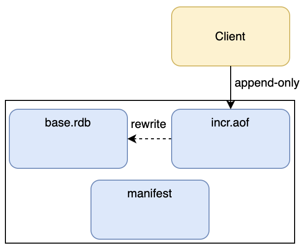
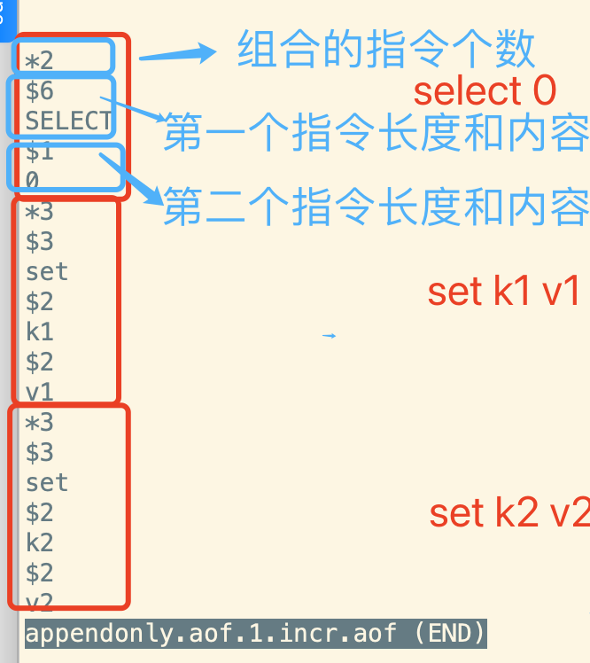
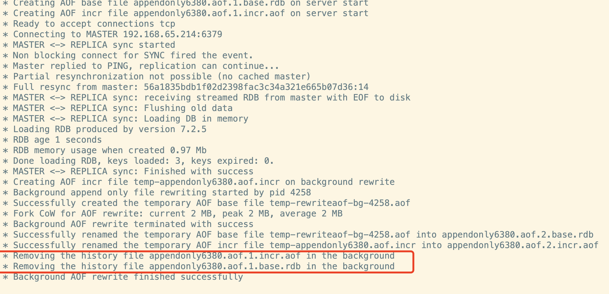
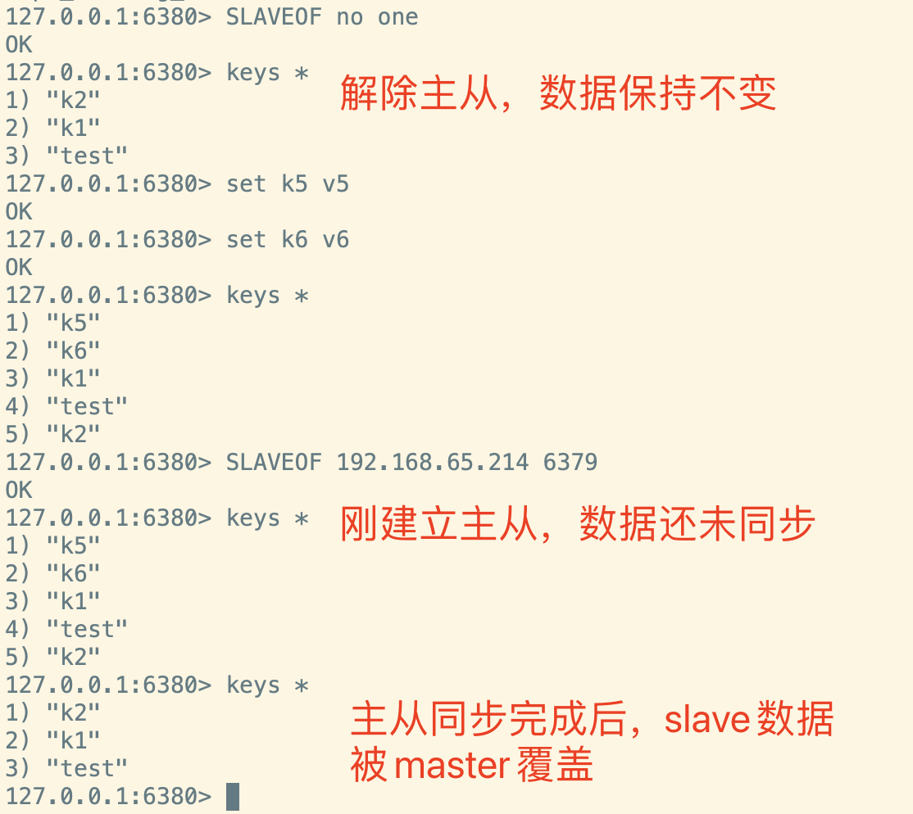
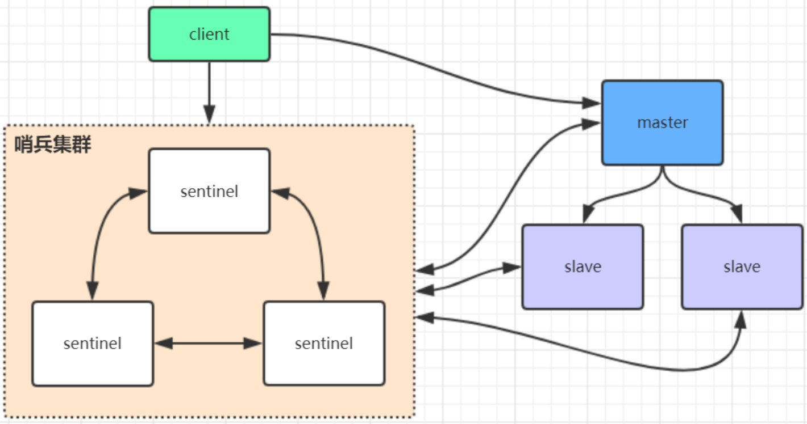
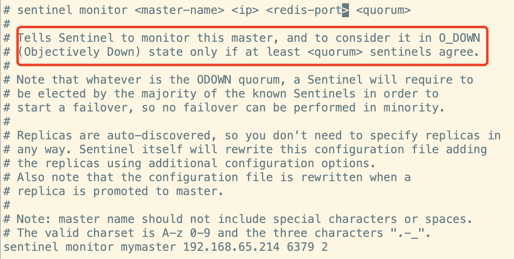
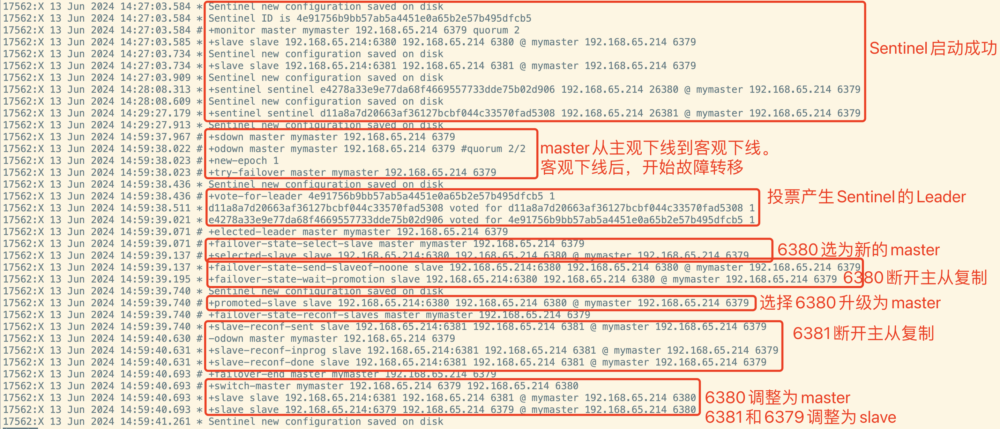
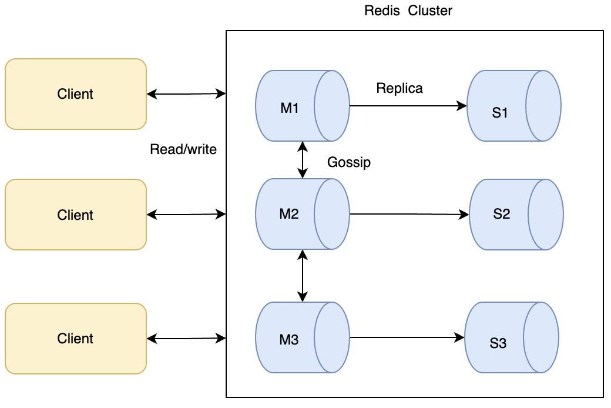
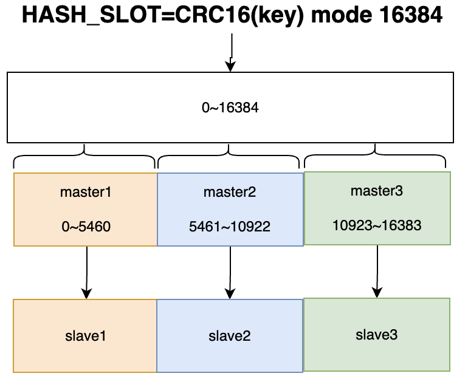

# Redis数据安全性分析

# 一、Redis性能压测脚本介绍

&#x9;Redis的所有数据是保存在内存当中的，得益于内存高效的读写性能，Redis的性能是非常强悍的。但是，内存的缺点是断电即丢失，所以，在实际项目中，Redis一旦需要保存一些重要的数据，就不可能完全使用内存保存数据。因此，在真实项目中要使用Redis，一定需要针对应用场景，对Redis的性能进行估算，从而在数据安全性与读写性能之间找到一个平衡点。

&#x9;Redis提供了压测脚本redis-benchmark，可以对Redis进行快速的基准测试。

```shell
# 20个线程，100W个请求，测试redis的set指令(写数据)
redis-benchmark -a 123qweasd -t set -n 1000000 -c 20
	...
Summary:
  throughput summary: 116536.53 requests per second   ##平均每秒11W次写操作。
  latency summary (msec):
          avg       min       p50       p95       p99       max
        0.111     0.032     0.111     0.167     0.215     3.199
```

> redis-benchmark更多参数，使用redis-benchmark --help指令查看

&#x9;后续逐步调整Redis的各种部署架构后，建议大家自行多进行几次对比测试。


# 二、Redis数据持久化机制详解

## 1、整体介绍Redis的数据持久化机制

&#x9;官网介绍地址： <https://redis.io/docs/latest/operate/oss_and_stack/management/persistence/>

&#x9;Redis提供了很多跟数据持久化相关的配置，大体上，可以组成以下几种策略：

*   无持久化：完全关闭数据持久化，不保证数据安全。相当于将Redis完全当做缓存来用
*   RDB(RedisDatabase)：按照一定的时间间隔缓存Redis所有数据快照。
*   AOF(Append Only File)：记录Redis收到的每一次写操作。这样可以通过操作重演的方式恢复Redis的数据
*   RDB+AOF：同时保存Redis的数据和操作。

&#x9;两种方式的优缺点：

*   RDB

    *   优点：

        1、RDB文件非常紧凑，非常适合定期备份数据。

        2、RDB快照非常适合灾难恢复。

        3、RDB备份时性能非常快，对主线程的性能几乎没有影响。RDB备份时，主线程只需要启动一个负责数据备份的子线程即可。所有的备份工作都由子线程完成，这对主线程的IO性能几乎没有影响。

        4、与AOF相比，RDB在进行大数据量重启时会快很多。
    *   缺点：

        1、RDB不能对数据进行实时备份，所以，总会有数据丢失的可能。

        2、RDB需要fork化子线程的数据写入情况，在fork的过程中，需要将内存中的数据克隆一份。如果数据量太大，或者CPU性能不是很好，RDB方式就容易造成Redis短暂的服务停用。相比之下，AOF也需要进行持久化，但频率较低。并且你可以调整日志重写的频率。
*   AOF

    *   优点：

        1、AOF持久化更安全。例如Redis默认每秒进行一次AOF写入，这样，即使服务崩溃，最多损失一秒的操作。

        2、AOF的记录方式是在之前基础上每次追加新的操作。因此AOF不会出现记录不完整的情况。即使因为一些特殊原因，造成一个操作没有记录完整，也可以使用redis-check-aof工具轻松恢复。

        3、当AOF文件太大时，Redis会自动切换新的日志文件。这样就可以防止单个文件太大的问题。

        4、AOF记录操作的方式非常简单易懂，你可以很轻松的自行调整日志。比如，如果你错误的执行了一次 FLUSHALL 操作，将数据误删除了。使用AOF，你可以简单的将日志中最后一条FLUSHALL指令删掉，然后重启数据库，就可以恢复所有数据。
    *   缺点：

        1、针对同样的数据集，AOF文件通常比RDB文件更大。

        2、在写操作频繁的情况下，AOF备份的性能通常比RDB更慢。

整体使用建议：

1、如果你只是把Redis当做一个缓存来用，可以直接关闭持久化。

2、如果你更关注数据安全性，并且可以接受服务异常宕机时的小部分数据损失，那么可以简单的使用RDB策略。这样性能是比较高的。

3、不建议单独使用AOF。RDB配合AOF，可以让数据恢复的过程更快。


## 2、RDB详解

&#x9;**1、 RDB能干什么**

&#x9;	RDB可以在指定的时间间隔，备份当前时间点的内存中的全部数据集，并保存到餐盘文件当中。通常是dump.rdb文件。在恢复时，再将磁盘中的快照文件直接都会到内存里。

&#x9;	由于RDB存的是全量数据，你甚至可以直接用RDB来传递数据。例如如果需要从一个Redis服务中将数据同步到另一个Redis服务(最好是同版本)，就可以直接复制最近的RDB文件。

&#x9;**2、相关重要配置**

1> save策略： 核心配置

```conf
# Save the DB to disk.
#
# save <seconds> <changes> [<seconds> <changes> ...]
#
# Redis will save the DB if the given number of seconds elapsed and it
# surpassed the given number of write operations against the DB.
#
# Snapshotting can be completely disabled with a single empty string argument
# as in following example:
#
# save ""
#
# Unless specified otherwise, by default Redis will save the DB:
#   * After 3600 seconds (an hour) if at least 1 change was performed
#   * After 300 seconds (5 minutes) if at least 100 changes were performed
#   * After 60 seconds if at least 10000 changes were performed
#
# You can set these explicitly by uncommenting the following line.
#
# save 3600 1 300 100 60 10000
```

2> dir 文件目录

3> dbfilename 文件名 默认dump.rdb

4> rdbcompression 是否启用RDB压缩，默认yes。 如果不想消耗CPU进行压缩，可以设置为no

5> stop-writes-oin-bgsave-error 默认yes。如果配置成no，表示你不在乎数据不一致或者有其他的手段发现和控制这种不一致。在快照写入失败时，也能确保redis继续接受新的写入请求。

6>rdbchecksum 默认yes。在存储快照后，还可以让redis使用CRC64算法来进行数据校验，但是这样做会增加大约10%的性能消耗。如果希望获得最大的性能提升，可以关闭此功能。

&#x9;**3、何时会触发RDB备份**

1> 到达配置文件中默认的快照配置时，会自动触发RDB快照

2>手动执行save或者bgsave指令时，会触发RDB快照。 其中save方法会在备份期间阻塞主线程。bgsve则不会阻塞主线程。但是他会fork一个子线程进行持久化，这个过程中会要将数据复制一份，因此会占用更多内存和CPU。

3> 主从复制时会触发RDB备份。

&#x9;LASTSAVE指令查看最后一次成功执行快照的时间。时间是一个代表毫秒的LONG数字，在linux中可以使用date -d @{timestamp} 快速格式化。

## 3、AOF详解

&#x9;**1、AOF能干什么**

&#x9;	以日志的形式记录每个写操作(读操作不记录)。只允许追加文件而不允许改写文件。

&#x9;**2、相关重要配置**

1> appendonly 是否开启aof。 默认是不开启的。

2> appendfilename 文件名称。

```conf

# The base name of the append only file.
#
# Redis 7 and newer use a set of append-only files to persist the dataset
# and changes applied to it. There are two basic types of files in use:
#
# - Base files, which are a snapshot representing the complete state of the
#   dataset at the time the file was created. Base files can be either in
#   the form of RDB (binary serialized) or AOF (textual commands).
# - Incremental files, which contain additional commands that were applied
#   to the dataset following the previous file.
#
# In addition, manifest files are used to track the files and the order in
# which they were created and should be applied.
#
# Append-only file names are created by Redis following a specific pattern.
# The file name's prefix is based on the 'appendfilename' configuration
# parameter, followed by additional information about the sequence and type.
#
# For example, if appendfilename is set to appendonly.aof, the following file
# names could be derived:
#
# - appendonly.aof.1.base.rdb as a base file.
# - appendonly.aof.1.incr.aof, appendonly.aof.2.incr.aof as incremental files.
# - appendonly.aof.manifest as a manifest file.

appendfilename "appendonly.aof"
```

&#x9;Redis7中，对文件名称做了调整。原本只是一个文件，现在换成了三个文件。base.rdb文件即二进制的数据文件。incr.aof是增量的操作日志。manifest则是记录文件信息的元文件。其实在Redis7之前的版本中，aof文件也会包含二进制的RDB部分和文本的AOF部分。在Redis7中，将这两部分分成了单独的文件，这样，即可以分别用来恢复文件，也便于控制AOF文件的大小。



&#x9;从这几个文件中能够看到， 现在的AOF已经具备了RDB+AOF的功能。并且，拆分增量文件的方式，也能够进一步控制aof文件的大小。

3> appendfsync 同步方式。默认everysecond 每秒记录一次。no 不记录(交由操作系统进行内存刷盘)。 always 记录每次操作，数据更安全，但性能较低。

4> appenddirname AOF文件目录。新增参数，指定aof日志的文件目录。 实际目录是 {dir}+{appenddirname}

5> auto-aof-rewrite-percentage, auto-aof-rewrite-min-size 文件重写触发策略。默认每个文件64M， 写到100%，进行一次重写。

> Redis会定期对AOF中的操作进行优化重写，让AOF中的操作更为精简。例如将多个INCR指令，合并成一个SET指令。同时，在Redis7的AOF文件中，会生成新的base rdb文件和incr.aof文件。
>
> AOF重写也可以通过指令 BGREWRITEAOF 手动触发

6> no-appendfsync-on-rewrite aof重写期间是否同步

&#x9;**3、AOF文件内容解析**

&#x9;示例：打开aof配置，aof日志文件appendonly.aof。然后使用redis-cli连接redis服务，简单执行两个set操作。

```shell
[root@192-168-65-214 myredis]# redis-cli -a 123qweasd
Warning: Using a password with '-a' or '-u' option on the command line interface may not be safe.
127.0.0.1:6379> keys *
(empty array)
127.0.0.1:6379> set k1 v1
OK
127.0.0.1:6379> set k2 v2
OK
```

&#x9;然后，就可以打开appendonly.aof.1.incr.aof增量文件。里面其实就是按照Redis的协议记录了每一次操作。



&#x9;这就是redis的指令协议。redis就是通过TCP协议，一次次解析各个指令。比如一个set k1 v1 这样的指令，\*3表示由三个部分组成， 第一个部分 \$3 set 表示三个字符长度的set组成第一个部分。

&#x9;了解这个协议后，你甚至可以很轻松的自己写一个Redis的客户端。例如：

```java
package com.roy.redis;

import java.io.IOException;
import java.io.InputStream;
import java.io.OutputStream;
import java.net.Socket;

/**
 * Author： roy
 * Description：
 **/
public class MyRedisClient {

    OutputStream write;
    InputStream reader;

    public MyRedisClient(String host,int port) throws IOException {
        Socket socket = new Socket(host,port);
        write = socket.getOutputStream();
        reader = socket.getInputStream();

    }
	//auth 123qweasd
    public String auth(String password){
        //1 组装报文
        StringBuffer command = new StringBuffer();
        command.append("*2").append("\r\n");//参数数量
        command.append("$4").append("\r\n");//第一个参数长度
        command.append("AUTH").append("\r\n");//第一个参数值
        //socket编程需要关注二进制长度。
        command.append("$").append(password.getBytes().length).append("\r\n");//第二个参数长度
        command.append(password).append("\r\n");//第二个参数值

        //2 发送报文到
        try {
            write.write(command.toString().getBytes());
            //3 接收redis响应
            byte[] response = new byte[1024];
            reader.read(response);
            return new String(response);
        } catch (IOException e) {
            throw new RuntimeException(e);
        }
    }
    //set k4 v4
    public String set(String key, String value){
        //1 组装报文
        StringBuffer command = new StringBuffer();
        command.append("*3").append("\r\n");//参数数量
        command.append("$3").append("\r\n");//第一个参数长度
        command.append("SET").append("\r\n");//第一个参数值
        //socket编程需要关注二进制长度。
        command.append("$").append(key.getBytes().length).append("\r\n");//第二个参数长度
        command.append(key).append("\r\n");//第二个参数值

        command.append("$").append(value.getBytes().length).append("\r\n");//第三个参数长度
        command.append(value).append("\r\n");//第三个参数值
        //2 发送报文到
        try {
            write.write(command.toString().getBytes());
            //3 接收redis响应
            byte[] response = new byte[1024];
            reader.read(response);
            return new String(response);
        } catch (IOException e) {
            throw new RuntimeException(e);
        }
    }

    public static void main(String[] args) throws IOException {

        MyRedisClient client = new MyRedisClient("192.168.65.214",6379);
        System.out.println(client.auth("123qweasd"));
        System.out.println(client.set("test","test"));
    }
}

```

**4、AOF日志恢复**

&#x9;如果Redis服务出现一些意外情况，就会造成AOF日志中指令记录不完整。例如，手动编辑appendonly.aof.1.incr.aof日志文件，在最后随便输入一段文字，就可以模拟指令记录不完整的情况。这时，将Redis服务重启，就会发现重启失败。日志文件中会有如下错误日志：

```log
21773:M 11 Jun 2024 18:22:43.928 * DB loaded from base file appendonly.aof.1.base.rdb: 0.019 seconds
21773:M 11 Jun 2024 18:22:43.928 # Bad file format reading the append only file appendonly.aof.1.incr.aof: make a backup of your AOF file, then use ./redis-check-aof --fix <filename.manifest>
```

> 需要配置日志文件，例如： logfile "/root/myredis/logs/6379.log"

&#x9;这时就需要先将日志文件修复，然后才能启动。

```shell
[root@192-168-65-214 appendonlydir]# redis-check-aof --fix appendonly.aof.1.incr.aof 
Start checking Old-Style AOF
AOF appendonly.aof.1.incr.aof format error
AOF analyzed: filename=appendonly.aof.1.incr.aof, size=132, ok_up_to=114, ok_up_to_line=27, diff=18
This will shrink the AOF appendonly.aof.1.incr.aof from 132 bytes, with 18 bytes, to 114 bytes
Continue? [y/N]: y
Successfully truncated AOF appendonly.aof.1.incr.aof

--修复的过程实际上就是将最后那一条指令删除掉。
```

> 注，对于RDB文件，Redis同样提供了修复指令redis-check-rdb，但是，由于RDB是二进制压缩文件，一般不太可能被篡改，所以一般用得并不太多。


## 4、混合持久化策略

&#x9;RDB和AOF两种持久化策略各有优劣，所以在使用Redis时，是支持同时开启两种持久化策略的。在redis.conf配置文件中，有一个参数可以同时打开RDB和AOF两种持久化策略。

```conf
# Redis can create append-only base files in either RDB or AOF formats. Using
# the RDB format is always faster and more efficient, and disabling it is only
# supported for backward compatibility purposes.
aof-use-rdb-preamble yes
```

&#x9;这也说明，如果同时开启RDB和AOF两种持久化策略，那么Redis在恢复数据时，其实还是会优先选择从AOF的持久化文件开始恢复。因为通常情况下，AOF的数据集比RDB更完整。而且AOF的持久化策略现在已经明确包含了RDB和AOF两种格式，所以AOF恢复数据的效率也还是比较高的。

&#x9;但是要注意，既然服务重启时只找AOF文件，那是不是就不需要做RDB备份了呢？通常建议还是增加RDB备份。因为AOF数据通常在不断变化，这样其实不太利于定期做数据备份。所以通常建议保留RDB文件并定期进行备份，作为保证数据安全的后手。

&#x9;最后要注意，Redis的持久化策略只能保证单机的数据安全。如果服务器的磁盘坏了，那么再好的持久化策略也无法保证数据安全。如果希望进一步保证数据安全，那就需要增加以下几种集群化的方案了。

# 三、Redis主从复制Replica机制详解

&#x9;接下来的三种Redis分布式优化方案，主从复制、哨兵集群、Redis集群，都是在分布式场景下保护Redis数据安全以及流量分摊的方案。他们是层层递进的。

## **1、Replica是什么？有什么用？**

&#x9;官网介绍：<https://redis.io/docs/latest/operate/oss_and_stack/management/replication/>

&#x9;redis.conf中的描述

```conf
# Master-Replica replication. Use replicaof to make a Redis instance a copy of
# another Redis server. A few things to understand ASAP about Redis replication.
#
#   +------------------+      +---------------+
#   |      Master      | ---> |    Replica    |
#   | (receive writes) |      |  (exact copy) |
#   +------------------+      +---------------+
#
# 1) Redis replication is asynchronous, but you can configure a master to
#    stop accepting writes if it appears to be not connected with at least
#    a given number of replicas.
# 2) Redis replicas are able to perform a partial resynchronization with the
#    master if the replication link is lost for a relatively small amount of
#    time. You may want to configure the replication backlog size (see the next
#    sections of this file) with a sensible value depending on your needs.
# 3) Replication is automatic and does not need user intervention. After a
#    network partition replicas automatically try to reconnect to masters
#    and resynchronize with them.	
```

简单总结：主从复制。当Master数据有变化时，自动将新的数据异步同步到其他slave中。

&#x9;最典型的作用：

*   读写分离：mater以写为主，Slave以读为主
*   数据备份+容灾恢复

## **2、如何配置Replica？**

&#x9;配置方式在基础课程部分有详细讲解，这里不做过多重复。简单总结一个原则：**配从不配主**。 这意味着对于一个Redis服务，可以在几乎没有影响的情况下，给他配置一个或者多个从节点。

&#x9;相关核心操作简化为以下几点：

*   REPLICAOF host port|NO ONE : 一般配置到redis.conf中。
*   SLAVEOF host port|NO ONE： 在运行期间修改slave节点的信息。如果该服务已经是某个主库的从库了，那么就会停止和原master的同步关系。

## **3、如何确定主从状态？从库可以写数据吗？**

&#x9;主从状态可以通过 info replication查看。例如，在一个主从复制的master节点上查看到的主从状态是这样的：

```shell
127.0.0.1:6379> info replication
# Replication
role:master
connected_slaves:1
slave0:ip=192.168.65.214,port=6380,state=online,offset=56,lag=1
master_failover_state:no-failover
master_replid:56a1835bdb1f02d2398fac3c34a321e665b07d36
master_replid2:0000000000000000000000000000000000000000
master_repl_offset:56
second_repl_offset:-1
repl_backlog_active:1
repl_backlog_size:1048576
repl_backlog_first_byte_offset:1
repl_backlog_histlen:56
```

> 重点要观察slave的state状态。 另外，可以观察下master\_repl\_offset参数。如果是刚建立Replica，数据同步是需要过程的，这时可以看到offset往后推移的过程。

&#x9;从节点上查看到的主从状态是这样的：

```shell
127.0.0.1:6380> info replication
# Replication
role:slave
master_host:192.168.65.214
master_port:6379
master_link_status:up
master_last_io_seconds_ago:6
master_sync_in_progress:0
slave_read_repl_offset:574
slave_repl_offset:574
slave_priority:100
slave_read_only:1
replica_announced:1
connected_slaves:0
master_failover_state:no-failover
master_replid:56a1835bdb1f02d2398fac3c34a321e665b07d36
master_replid2:0000000000000000000000000000000000000000
master_repl_offset:574
second_repl_offset:-1
repl_backlog_active:1
repl_backlog_size:1048576
repl_backlog_first_byte_offset:15
repl_backlog_histlen:560
```

> 重点要观察master\_link\_status

&#x9;默认情况下，从库是只读的，不允许写入数据。因为数据只能从master往slave同步，如果slave修改数据，就会造成数据不一致。

```shell
127.0.0.1:6380> set k4 v4
(error) READONLY You can't write against a read only replica.
```

&#x9;redis.conf中配置了slave的默认权限

```conf
# Since Redis 2.6 by default replicas are read-only.
#
# Note: read only replicas are not designed to be exposed to untrusted clients
# on the internet. It's just a protection layer against misuse of the instance.
# Still a read only replica exports by default all the administrative commands
# such as CONFIG, DEBUG, and so forth. To a limited extent you can improve
# security of read only replicas using 'rename-command' to shadow all the
# administrative / dangerous commands.
replica-read-only yes
```

&#x9;这里也提到，对于slave从节点，虽然禁止了对数据的写操作，但是并没有禁止CONFIG、DEBUG等管理指令，这些指令如果和主节点不一致，还是容易造成数据不一致。如果为了安全起见，可以使用rename-command方法屏蔽这些危险的指令。

&#x9;例如在redis.conf配置文件中增加配置 rename-command CONFIG ""  。就可以屏蔽掉slave上的CONFIG指令。

> 很多企业在维护Redis时，都会通过rename 直接禁用keys , flushdb, flushall等这一类危险的指令。


## 4、如果Slave上已经有数据了，同步时会如何处理？

&#x9;在从节点的日志当中其实能够分析出结果：



&#x9;也可以在从节点尝试解除主从关系，再重新建立主从关系测试一下。



## 5、主从复制工作流程

1》 Slave启动后，向master发送一个sync请求。等待建立成功后，slave会删除掉自己的数据日志文件，等待主节点同步。

2》master接收到slave的sync请求后，会触发一次RDB全量备份，同时收集所有接收到的修改数据的指令。然后master将RDB和操作指令全量同步给slave。完成第一次全量同步。

3》主从关系建立后，master会定期向slave发送心跳包，确认slave的状态。心跳发送的间隔通过参数repl-ping-replica-period指定。默认10秒。

4》只要slave定期向master回复心跳请求，master就会持续将后续收集到的修改数据的指令传递给slave。同时，master会记录offset，即已经同步给slave的消息偏移量。

5》如果slave短暂不回复master的心跳请求，master就会停止向slave同步数据。直到slave重新上线后，master从offset开始，继续向slave同步数据。

## 6、主从复制的缺点

1》复制延时，信号衰减：  所有写操作都是先在master上操作，然后再同步到slave，所以数据同步一定会有延迟。当系统繁忙，或者slave数量增加时，这个延迟会更加严重。

2》master高可用问题： 如果master挂了，slave节点是不会自动切换master的，只能等待人工干预，重启master服务，或者调整主从关系，将一个slave切换成master，同时将其他slave的主节点调整为新的master。

&#x9;后续的哨兵集群，就相当于做这个人工干预的工作。当检测到master挂了之后，自动从slave中选择一个节点，切换成master。

3》从数据安全性的角度，主从复制牺牲了服务高可用，但是增加了数据安全。


# 四、Redis哨兵集群Sentinel机制详解

## 1、Sentinel是什么？有什么用

&#x9;官网介绍： <https://redis.io/docs/latest/operate/oss_and_stack/management/sentinel/>



&#x9;Redis的Sentinel不负责数据读写，主要就是给Redis的Replica主从复制提供高可用功能。主要作用有四个：

*   主从监控：监控主从Redis运行是否正常
*   消息通知：将故障转移的结果发送给客户端
*   故障转移：如果master异常，则会进行主从切换。将其中一个slave切换成为master。
*   配置中心：客户端通过连接哨兵可以获取当前Redis服务的master地址。

## 2、Sentinel核心配置

&#x9;Sentinel的环境搭建以及基础使用，在基础版中已经有详细过程。这里不再赘述。这里以单机模拟搭建Sentinel以及主从集群。Redis的服务端口为6379(master),6380,6381。Sentinel的服务端口为26379,26380,26381

&#x9;Sentinel最核心的配置其实就是  sentinel.conf中的sentinel monitor \<master-name> \<ip> \<redis-port> \<quorum>




&#x9;这个配置中，最抽象的参数就最后的那个quorum。这个参数是什么意思呢？这就需要了解一下Sentinel的工作原理。

## 3、解析Sentinel工作原理

&#x9;Sentinel的核心工作原理分两个步骤，一是如何发现master服务宕机了。二是发现master服务宕机后，如何切换新的master。

### 1. 如何发现master服务宕机

&#x9;这里有两个概念需要了解，S\_DOWN（主观下线）和 O\_DOWN（客观下线）

&#x9;对于每一Sentinel服务，他会不断地往master发送心跳，监听master的状态。如果经过一段时间（参数sentinel down-after-milliseconds \<master-name> \<milliseconds> 指定。默认30秒）没有收到master的响应，他就会主观的认为这个master服务下线了。也就是S\_DOWN。

&#x9;但是主观下线并不一定是master服务的问题，如果网络出现抖动或者阻塞，也会造成master的响应超时。为了防止网络抖动造成的误判，Redis的Sentinel就会互相进行沟通，当超过quorum个Sentinel节点都认为master已经出现S\_DOWN后，就会将master标记为O\_DOWN。此时才会真正确定master的服务是宕机的，然后就可以开始故障切换了。

&#x9;在配置Sentinel集群时，通常都会搭建奇数个节点，而将quorum配置为集群中的过半个数。这样可以最大化的保证Sentinel集群的可用性。

### 2. 发现master服务宕机后，如何切换新的master

&#x9;当确定master宕机后，Sentinel会主动将一个新的slave切换为mater。这个过程是怎么做的呢？通过以下一个Sentinel服务的日志，可以看到整个过程：



&#x9;从这个日志中，可以看到Sentinel在做故障切换时，是经过了以下几个步骤的：

(1) master变成O\_DOWN后，Sentinel会在集群中选举产生一个服务节点作为Leader。Leader将负责向其他Redis节点发送命令，协调整个故障切换过程。在选举过程中，Sentinel是采用的Raft算法，这是一种多数派统一的机制，其基础思想是对集群中的重大决议，只要集群中超过半数的节点投票同意，那么这个决议就会成为整个集群的最终决议。这也是为什么建议Sentinel的quorum设置为集群超半数的原因。

(2) Sentinel会在剩余健康的Slave节点中选举出一个节点作为新的Master。 选举的规则如下：

*   首先检查是否有提前配置的优先节点：各个服务节点的redis.conf中的replica-priority配置最低的从节点。这个配置的默认值是100。如果大家的配置都一样，就进入下一个检查规则。
*   然后检查复制偏移量offset最大的从节点。也就是找同步数据最快的slave节点。因为他的数据是最全的。如果大家的offset还是一样的，就进入下一个规则
*   最后按照slave的RunID字典顺序最小的节点。

(3) 切换新的主节点。 Sentinel Leader给新的mater节点执行 slave of no one操作，将他提升为master节点。 然后给其他slave发送slave of 指令。让其他slave成为新Master的slave。

(4) 如果旧的master恢复了，Sentinel Leader会让旧的master降级为slave，并从新的master上同步数据，恢复工作。

&#x9;最终，各个Redis的配置信息，会输出到Redis服务对应的redis.conf文件中，完成配置覆盖。

## 4、Sentinel的缺点

&#x9;Sentinel+Replica的集群服务，可以实现自动故障恢复，所以可用性以及性能都还是比较好的。但是这种方案也有一些问题:

(1) 对客户端不太友好

&#x9;由于master需要切换，这也就要求客户端也要将写请求频繁切换到master上。

(2) 数据不安全&#x20;

&#x9;在主从复制集群中，不管~~master~~是谁，所有的数据都以master为主。当master宕机后，那些在master上已经完成了，但是还没有同步给其他slave的操作，就会彻底丢失。因为只要master一完成了切换，所有数据就以新的master为准了。

&#x9;因此，在企业实际运用中，用得更多的是下面的Redis集群服务。

# 五、Redis集群Cluster机制详解

## 1、Cluster是什么？有什么用？

&#x9;官网地址：<https://redis.io/docs/latest/operate/oss_and_stack/management/scaling/>

&#x9;一句话总结：将多组Redis Replica主从集群整合到一起，像一个Redis服务一样对外提供服务。

&#x9;

&#x9;所以Redis Cluster的核心依然是Replica复制集。

&#x9;**Redis Cluster通过对复制集进行合理整合后，核心是要解决三个问题：**

- **客户端需要频繁切换master的问题**

- **服务端数据量太大后，单个复制集难以承担的问题**

- **master节点挂了之后，主动将slave切换成master，保证服务稳定**


## 2、Cluster的核心配置

&#x9;Cluster的基础搭建工作在基础版中已经给大家逐一演示，这里同样不再赘述。接下来还是以单机快速模拟三主三从的Redis集群服务，带大家深入理解集群的原理。

&#x9;构建Redis集群的核心配置是要在redis.conf中开启集群模式。并且指定一个给集群进行修改的配置文件。

```conf
# Normal Redis instances can't be part of a Redis Cluster; only nodes that are
# started as cluster nodes can. In order to start a Redis instance as a
# cluster node enable the cluster support uncommenting the following:
#
cluster-enabled yes

# Every cluster node has a cluster configuration file. This file is not
# intended to be edited by hand. It is created and updated by Redis nodes.
# Every Redis Cluster node requires a different cluster configuration file.
# Make sure that instances running in the same system do not have
# overlapping cluster configuration file names.
#
cluster-config-file nodes-6379.conf
```

&#x9;以下是其中一个服务的配置文件示例：

    # 允许所有的IP地址
    bind * -::*
    # 后台运行
    daemonize yes
    # 允许远程连接
    protected-mode no
    # 密码
    requirepass 123qweasd
    # 主节点密码
    masterauth 123qweasd
    # 端口
    port 6381
    # 开启集群模式
    cluster-enabled yes
    # 集群配置文件
    cluster-config-file nodes-6381.conf
    # 集群节点超时时间
    cluster-node-timeout 5000
    # log日志
    logfile "/root/myredis/cluster/redis6381.log"
    # pid文件
    pidfile /var/run/redis_6381.pid
    # 开启AOF持久化
    appendonly yes
    # 配置数据存储目录
    dir "/root/myredis/cluster"
    # AOF目录
    appenddirname "aof"
    # AOF文件名
    appendfilename "appendonly6381.aof"
    # RBD文件名
    dbfilename "dump6381.rdb"

&#x9;接下来依次创建6381,6382,6383,6384,6385,6386六个端口的Redis配置文件，并启动服务。

&#x9;接下来就可以构建Redis集群。将多个独立的Redis服务整合成一个统一的集群。

```shell
[root@192-168-65-214 cluster]# redis-cli -a 123qweasd --cluster create --cluster-replicas 1 192.168.65.214:6381 192.168.65.214:6382 192.168.65.214:6383 192.168.65.214:6384 192.168.65.214:6385 192.168.65.214:6386
```

&#x9;其中 --cluster create表示创建集群。 --cluster-replicas 表示为每个master创建一个slave节点。接下来，Redis会自动分配主从关系，形成Redis集群。

&#x9;集群启动完成后，可以使用客户端连接上其中任意一个服务端，验证集群。

```shell
--连接Redis集群。-c表示集群模式
redis-cli -p 6381 -a 123qweasd -c 
--查看集群节点
cluster nodes
--查看集群状态
cluster info
```

> Redis在分配主从关系时，会优先将主节点和从节点分配在不同的机器上。我们这里用一台服务器模拟集群，就无法体现出这种特性。

&#x9;接下来再来逐步验证之前提到的Redis集群要解决的三个问题。

```shell
-- 客户端连接集群
[root@192-168-65-214 cluster]# redis-cli -a 123qweasd -p 6381 -c
Warning: Using a password with '-a' or '-u' option on the command line interface may not be safe.
!!! 设置k1时，集群会将k1分配到6383节点，解决了数据太大的问题。
!!! 客户端会自动切换到6383服务上，解决了服务端切换master的问题
127.0.0.1:6381> set k1 v1
-> Redirected to slot [12706] located at 192.168.65.214:6383
OK
192.168.65.214:6383> set k2 v2
-> Redirected to slot [449] located at 192.168.65.214:6381
OK
192.168.65.214:6381> set k3 v3
OK
```

下面验证集群的高可用

```shell
--  查看集群状态
[root@192-168-65-214 cluster]# redis-cli -a 123qweasd -p 6381 -c cluster nodes
Warning: Using a password with '-a' or '-u' option on the command line interface may not be safe.
4bc8ba4aa07fbed559befbc7af14424e78ebf3ef 192.168.65.214:6384@16384 slave ff9437319ceee739d72cc23b987bd28002b72eae 0 1718353142000 3 connected
3b1848099a74e6de1669bde3af108132d8b03e41 192.168.65.214:6385@16385 slave fd3cbd892f11e950104955f7297adb20fab0253c 0 1718353143567 1 connected
ff9437319ceee739d72cc23b987bd28002b72eae 192.168.65.214:6383@16383 master - 0 1718353143065 3 connected 10923-16383
883a01f49ad112220253dcf4e6dc54ac12db6355 192.168.65.214:6386@16386 slave 698f36253e9f01470a179f4f04f5d6c683437851 0 1718353142000 2 connected
698f36253e9f01470a179f4f04f5d6c683437851 192.168.65.214:6382@16382 master - 0 1718353143000 2 connected 5461-10922
fd3cbd892f11e950104955f7297adb20fab0253c 192.168.65.214:6381@16381 myself,master - 0 1718353141000 1 connected 0-5460

--关闭6383服务
[root@192-168-65-214 cluster]# redis-cli -a 123qweasd -p 6383 -c shutdown

-- 重新查看集群状态
[root@192-168-65-214 cluster]# redis-cli -a 123qweasd -p 6381 -c cluster nodes
Warning: Using a password with '-a' or '-u' option on the command line interface may not be safe.
4bc8ba4aa07fbed559befbc7af14424e78ebf3ef 192.168.65.214:6384@16384 master - 0 1718353206000 8 connected 10923-16383
3b1848099a74e6de1669bde3af108132d8b03e41 192.168.65.214:6385@16385 slave fd3cbd892f11e950104955f7297adb20fab0253c 0 1718353207256 1 connected
ff9437319ceee739d72cc23b987bd28002b72eae 192.168.65.214:6383@16383 master,fail - 1718353192017 1718353189508 3 disconnected
883a01f49ad112220253dcf4e6dc54ac12db6355 192.168.65.214:6386@16386 slave 698f36253e9f01470a179f4f04f5d6c683437851 0 1718353206252 2 connected
698f36253e9f01470a179f4f04f5d6c683437851 192.168.65.214:6382@16382 master - 0 1718353206553 2 connected 5461-10922
fd3cbd892f11e950104955f7297adb20fab0253c 192.168.65.214:6381@16381 myself,master - 0 1718353206000 1 connected 0-5460
!!! 集群信息发生了切换，6384服务从slave切换成了master（节点切换需要一点点时间）

--重新启动6383服务
[root@192-168-65-214 cluster]# redis-server redis6383.conf

--重新查看集群状态
[root@192-168-65-214 cluster]# redis-cli -a 123qweasd -p 6381 -c cluster nodes
Warning: Using a password with '-a' or '-u' option on the command line interface may not be safe.
4bc8ba4aa07fbed559befbc7af14424e78ebf3ef 192.168.65.214:6384@16384 master - 0 1718353409018 8 connected 10923-16383
3b1848099a74e6de1669bde3af108132d8b03e41 192.168.65.214:6385@16385 slave fd3cbd892f11e950104955f7297adb20fab0253c 0 1718353409000 1 connected
ff9437319ceee739d72cc23b987bd28002b72eae 192.168.65.214:6383@16383 slave 4bc8ba4aa07fbed559befbc7af14424e78ebf3ef 0 1718353409519 8 connected
883a01f49ad112220253dcf4e6dc54ac12db6355 192.168.65.214:6386@16386 slave 698f36253e9f01470a179f4f04f5d6c683437851 0 1718353409519 2 connected
698f36253e9f01470a179f4f04f5d6c683437851 192.168.65.214:6382@16382 master - 0 1718353410022 2 connected 5461-10922
fd3cbd892f11e950104955f7297adb20fab0253c 192.168.65.214:6381@16381 myself,master - 0 1718353409000 1 connected 0-5460
!!! 6383成为了6384的slave。
```

> 注：集群故障转移也可以通过手动形式触发。例如在一个slave节点上执行cluster failover，就会触发一次故障转移，尝试将这个slave提升为master。

&#x9;从节点信息可以看到，集群中在每个master的最后，都记录了他负责的slot槽位，这些slot就是Redis集群工作的核心。

## 3、详解Slot槽位

&#x9;Redis集群设置16384个哈希槽。每个key会通过CRC16校验后，对16384取模，来决定放到哪个槽。集群的每个节点负责一部分的hash槽。

&#x9;

### 问题1、Slot如何分配

&#x9;Redis集群中内置16384个槽位。在建立集群时，Redis会根据集群节点数量，将这些槽位尽量平均的分配到各个节点上。并且，如果集群中的节点数量发生了变化。(增加了节点或者减少了节点)。就需要触发一次reshard，重新分配槽位。而槽位中对应的key，也会随着进行数据迁移。

```shell
# 增加6387,6388两个Redis服务，并启动

# 添加到集群当中
redis-cli -a 123qweasd -p 6381 --cluster add-node 192.168.65.214:6387 192.168.65.214:6388
# 确定集群状态  此时新节点上是没有slot分配的
redis-cli -a 123qweasd -p 6381 --cluster check 192.168.65.214:6381
# 手动触发reshard，重新分配槽位
redis-cli -a 123qweasd -p 6381 reshard 192.168.65.214:6381
# 再次确定集群状态  此时新节点上会有一部分槽位分配
redis-cli -a 123qweasd -p 6381 --cluster check 192.168.65.214:6381
```

&#x9;reshard操作会从三个旧节点当中分配一部分新的槽位给新的节点。在这个过程中，Redis也就并不需要移动所有的数据，只需要移动那一部分槽位对应的数据。

&#x9;除了这种自动调整槽位的机制，Redis也提供了手动调整槽位的指令。可以使用cluster help查看相关调整指令。

> 这些指令通常用得比较少，大家自行了解。

&#x9;另外，Redis集群也会检查每个槽位是否有对应的节点负责。如果负责一部分槽位的一组复制节点都挂了，默认情况下Redis集群就会停止服务。其他正常的节点也无法接收写数据的请求。

&#x9;如果此时，需要强制让Redis集群提供服务，可以在配置文件中，将cluster-require-full-coverage参数手动调整为no。

    # By default Redis Cluster nodes stop accepting queries if they detect there
    # is at least a hash slot uncovered (no available node is serving it).
    # This way if the cluster is partially down (for example a range of hash slots
    # are no longer covered) all the cluster becomes, eventually, unavailable.
    # It automatically returns available as soon as all the slots are covered again.
    #
    # However sometimes you want the subset of the cluster which is working,
    # to continue to accept queries for the part of the key space that is still
    # covered. In order to do so, just set the cluster-require-full-coverage
    # option to no.
    #
    # cluster-require-full-coverage yes

> 通常不建议这样做，因为这意味着Redis提供的数据服务是不完整的。

### 问题2、如何确定key与slot的对应关系？

&#x9;Redis集群中，对于每一个要写入的key，都会寻找所属的槽位。计算的方式是 CRC16(key) mod 16384。

&#x9;首先，这意味着在集群当中，那些批量操作的复合指令(如mset,mhset)支持会不太好。如果他们分属不同的槽位，就无法保证他们能够在一个服务上进行原子性操作。

```shell
127.0.0.1:6381> mset k1 v1 k2 v2 k3 v3
(error) CROSSSLOT Keys in request don't hash to the same slot
```

> 这也是对分布式事务的一种思考。如果这种批量指令需要分到不同的Redis节点上操作，那么这个指令的操作原子性问题就称为了一个分布式事务问题。而分布式事务是一件非常复杂的事情，不要简单的认为用上seata这样的框架就很容易解决。在大部分业务场景下，直接拒绝分布式事务，是一种很好的策略。

&#x9;然后，在Redis中，提供了指令 CLUSTER KEYSLOT 来计算某一个key属于哪个Slot

```shell
127.0.0.1:6381> CLUSTER KEYSLOT k1
(integer) 12706
```

&#x9;另外，Redis在计算hash槽时，会使用hashtag。如果key中有大括号{}，那么只会根据大括号中的hash tag来计算槽位。

```shell
127.0.0.1:6381> CLUSTER KEYSLOT k1
(integer) 12706
127.0.0.1:6381> CLUSTER KEYSLOT roy{k1}
(integer) 12706
127.0.0.1:6381> CLUSTER KEYSLOT roy:k1
(integer) 12349
-- 使用相同的hash tag，能保证这些数据都是保存在同一个节点上的。
127.0.0.1:6381>  mset user_{1}_name roy user_{1}_id 1 user_{1}_password 123
-> Redirected to slot [9842] located at 192.168.65.214:6382
OK
```

&#x9;在大型Redis集群中，经常会出现数据倾斜的问题。也就是大量的数据被集中存储到了集群中某一个热点Redis节点上。从而造成这一个节点的负载明显大于其他节点。这种数据倾斜问题就容易造成集群的资源浪费。

&#x9;调整数据倾斜的问题，常见的思路就是分两步。第一步，调整key的结构，尤其是那些访问频繁的热点key，让数据能够尽量平均的分配到各个slot上。第二步，调整slot的分布，将那些数据量多，访问频繁的热点slot进行重新调配，让他们尽量平均的分配到不同的Redis节点上。
