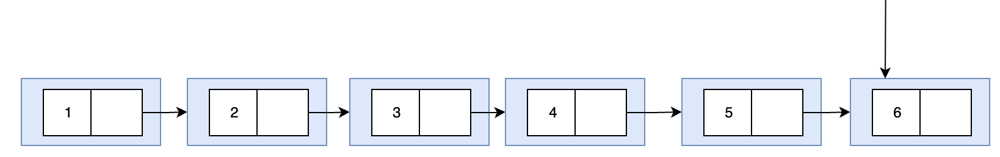

# Redis7 底层数据结构解析


&#x9;这一章节我们将深入理解Redis底层数据结构，也就是尝试真正去了解我们指定的set k1 v1这样的指令，是怎么执行的，数据是怎么保存的。

&#x9;开始之前，做两点简单声明：

&#x9;第一：对于大多数程序员，研究Redis底层结构的目的，只有一个：面试！也就是体现你对Redis的理解深度，而并不是要你去写一个Redis。因此，接下来主要分析常用的几种数据类型的底层结构，中间必然会涉及到一些Redis底层的C源码。对于这些源码，只抽取其中部分精华，用做知识点的佐证。如果之间有逻辑断层，或者你想要了解一些其他的数据类型，可以自行看源码补充。

&#x9;第二：Redis的底层数据结构其实是经常变化的，不光Redis6到Redis7这样的大版本，就算同样大版本下的不同小版本，底层结构也是经常有变化的。对于讲到的每种数据结构，会尽量在Redis源码中进行验证。如果没有说明，Redis的版本是目前最新的7.2.5。


# 1. 整体理解Redis底层数据结构

## 1.1 Redis数据在底层是什么样的？

&#x9;在应用层面，我们熟悉Redis有多种不同的数据类型，比如 string, hash, list, set, zset 等。但是这些数据在Redis的底层是什么样子呢？实际上Redis提供了一个指令OBJECT可以用来查看数据的底层类型。

```shell
127.0.0.1:6379> OBJECT HELP
 1) OBJECT <subcommand> [<arg> [value] [opt] ...]. Subcommands are:
 2) ENCODING <key>
 3)     Return the kind of internal representation used in order to store the value
 4)     associated with a <key>.
 5) FREQ <key>
 6)     Return the access frequency index of the <key>. The returned integer is
 7)     proportional to the logarithm of the recent access frequency of the key.
 8) IDLETIME <key>
 9)     Return the idle time of the <key>, that is the approximated number of
10)     seconds elapsed since the last access to the key.
11) REFCOUNT <key>
12)     Return the number of references of the value associated with the specified
13)     <key>.
14) HELP
15)     Print this help.

127.0.0.1:6379> set k1 v1
OK
127.0.0.1:6379> OBJECT ENCODING k1
"embstr"
```

&#x9;可以看到，k1 v1 这个 `<k, v>` 键值对，他在底层的数据类型就是 `embstr `。Redis在底层，其实是这样描述这些数据类型的。

server.h 的 880 行：

```c
/* Objects encoding. Some kind of objects like Strings and Hashes can be
 * internally represented in multiple ways. The 'encoding' field of the object
 * is set to one of this fields for this object. */
#define OBJ_ENCODING_RAW 0     /* Raw representation */
#define OBJ_ENCODING_INT 1     /* Encoded as integer */
#define OBJ_ENCODING_HT 2      /* Encoded as hash table */
#define OBJ_ENCODING_ZIPMAP 3  /* No longer used: old hash encoding. */
#define OBJ_ENCODING_LINKEDLIST 4 /* No longer used: old list encoding. */
#define OBJ_ENCODING_ZIPLIST 5 /* No longer used: old list/hash/zset encoding. */
#define OBJ_ENCODING_INTSET 6  /* Encoded as intset */
#define OBJ_ENCODING_SKIPLIST 7  /* Encoded as skiplist */
#define OBJ_ENCODING_EMBSTR 8  /* Embedded sds string encoding */
#define OBJ_ENCODING_QUICKLIST 9 /* Encoded as linked list of listpacks */
#define OBJ_ENCODING_STREAM 10 /* Encoded as a radix tree of listpacks */
#define OBJ_ENCODING_LISTPACK 11 /* Encoded as a listpack */
```

> 这里也能看到有些类型已经不再使用了。比如ZIPLIST。如果你看过一些以前的Redis的文章，就会知道，ZIPLIST是在Redis6中经常使用的一个重要的数据类型。但是现在已经不再使用了。在Redis7中，基本已经使用listpack替代了ziplist。

&#x9;然后，在上面的注释中还可以看到。这些编码方式都是使用在Object的encoding字段里的。这个Object是什么呢？

server.h 的 900行：

```c
struct redisObject {
    unsigned type:4;
    unsigned encoding:4;
    unsigned lru:LRU_BITS; /* LRU time (relative to global lru_clock) or
                            * LFU data (least significant 8 bits frequency
                            * and most significant 16 bits access time). */
    int refcount;
    void *ptr;
};
```

&#x9;Redis是一个 `<k, v>` 型的数据库，其中key通常都是string类型的字符串对象，而value在底层就统一是 redisObject 对象。

&#x9;而这个redisObject结构，实际上就是Redis内部抽象出来的一个封装所有底层数据结构的统一对象。这就类似于Java的面向对象的设计方式。

&#x9;这里面几个核心字段意义如下：

*   type：Redis的上层数据类型。比如string,hash,set等，可以使用指令type key查看。
*   encoding： Redis内部的数据类型。
*   lru：当内存超限时会采用LRU算法清除内存中的对象。关于LRU与LFU，在redis.conf中有描述

```conf
# LRU means Least Recently Used
# LFU means Least Frequently Used
```

*   refcount：表示对象的引用次数。可以使用OBJECT REFCOUNT key 指令查看。
*   *ptr：这是一个指针，指向真正底层的数据结构。encoding只是一个类型描述。实际数据是保存在ptr指向的具体结构里。


## 1.2 Redis常见数据类型的底层数据结构总结

&#x9;我们已经知道了Redis有上层的应用类型，也有底层的数据结构。那么这些上层数据类型和底层数据结构是怎么对应的呢？

```shell
127.0.0.1:6379> set k1 v1
OK
127.0.0.1:6379> type k1
string
127.0.0.1:6379> object encoding k1
"embstr"
```

&#x9;这就是一种对应关系。也就是说，在应用层面，我们操作的是string这样的数据类型，但是Redis在底层，操作的是embstr这样一种数据结构。但是，这些上层的数据类型和底层的数据结构之间，是不是就是简单的一一对应的关系呢？

```shell
127.0.0.1:6379> set k2 1
OK
127.0.0.1:6379> type k2
string
127.0.0.1:6379> object encoding k2
"int"
127.0.0.1:6379> set k3 aaaaaaaaaaaaaaaaaaaaaaaaaaaaaaaaaaaaaaaaaaaaaaaaaaaaaaaaaaaaaaaaaaa
OK
127.0.0.1:6379> type k3
string0
127.0.0.1:6379> OBJECT ENCODING k3
"raw"
```

&#x9;从这里能够看到，每一种上层数据类型对应底层多种不同的数据结构，也就是说，同样的一个数据类型，Redis底层的处理方式是不同的。

> Redis提供了一个指令，可以直接调试某一个key的结构信息。但是这种方式默认是关闭的。
>
> ```shell
> 127.0.0.1:6379> DEBUG Object k1
> (error) ERR DEBUG command not allowed. If the enable-debug-command option is set to "local", you can run it from a local connection, otherwise you need to set this option in the configuration file, and then restart the server.
> ```
>
> 按照要求，修改配置文件，重启Redis服务后，就可以看到每一个key的内部结构
>
> ```shell
> 127.0.0.1:6379> DEBUG object k1
> Value at:0x7f0e36264c80 refcount:1 encoding:embstr serializedlength:3 lru:7607589 lru_seconds_idle:23
> ```

&#x9;现在搞明白encoding是什么了之后，问题就到了下一步，这个ptr指针到底指向了哪些数据结构呢？

&#x9;下面直接列出了Redis中上层数据类型和底层真正存储数据的数据结构的对应关系。

| Redis版本 | string     | set                       | zset              | list               | hash              |
| :------ | :--------- | :------------------------ | :---------------- | :----------------- | :---------------- |
| Redis 6 | SDS(动态字符串) | intset+hashtable          | skiplist+ziplist  | quicklist+ziplist  | hashtable+ziplist |
| Redis 7 | SDS        | intset+listpack+hashtable | skiplist+listpack | quicklist+listpack | hashtable+list    |

&#x9;这个列表里的这些数据结构，如果不理解，先直接记住。 这是Redis一个比较高频的面试题(高级职位)。至于具体的细节，后面会慢慢分析。

&#x9;另外，其他的数据类型，包括一些扩展模块的数据类型，面试中基本不太可能问得太深，自行理解。

> &#x9;Redis6和Redis7最大的区别就在于Redis7已经用listpack替代了ziplist。只不过为了保证兼容性，Redis7中并没有移除ziplist的代码以及配置。listpack与ziplist的区别也是一个高频的面试题，后面会逐步介绍


# 2. String数据结构详解

&#x9;从之前的简单实验中已经看到，string数据，在底层对应了int ,embstr,raw三种不同的数据结构。他们到底是什么呢？下面分几个问题逐步深入。

## 2.1 string数据是如何存储的？

&#x9;**先上结论，再验证。** string数据的类型，会根据value的类型不同，有以下几种处理方式

*   int :  如果value可以转换成一个long类型的数字，那么就用int保存value。只有整数才会使用int,如果是浮点数，Redis内部其实是先将浮点数转化成字符串，然后保存
*   embstr ： 如果value是一个字符串类型，并且长度小于44字节的字符串，那么Redis就会用embstr保存。代表embstr的底层数据结构是SDS(Simple Dynamic String 简单动态字符串)
*   raw ：如果value是一个字符串类型，并且长度大于44字节，就会用raw保存。

&#x9;**源码验证：**

&#x9;在客户端执行一个 `set k1 v1` 这样的指令，会进入 `t_string.c` 的 `setComand` 方法处理。

t_string.c 的 295 行：


&#x9;这个 tryObjectEncoding 的方法实现，在 object.c 中

object.c 的 614行的 `tryObjectEncodingEx` 方法。 关键部分如下：


> 1、从这里可以看到，对于数字长度超过20的大数字，Redis是不会用int保存的。
>
> 2、OBJ_SHARED_INTEGER = 1000 。对于1000以内的数字，直接指向内存。

object.c 的 685行：


## 2.2 string类型对应的 int, embstr, raw 有什么区别？

### 2.2.1 int类型

&#x9;就是尽量在对应的robj中的ptr指向一个缓存数据对象。


### 2.2.2 embstr类型

&#x9;如果字符串类型长度小于44，就会创建一个embstr的对象。这个创建的方法是这样的：

object.c 的92行：


&#x9;embstr字面意思就是内嵌字符串。 所谓内嵌的核心，其实就是将新创建的SDS对象直接分配在对象自己的内存后面。这样内存读取效率明显更高。

> 这里有一段介绍， SDS其实是一段不可修改的字符串。这意味着如果使用APPEND之类的指令尝试修改一个key的值，那么就算value的长度没有超过44,Redis也会使用一个新创建的raw类型，而不再使用原来的SDS。&#x20;


&#x9;这个SDS是什么呢？其实他就是Redis底层对于String的一种封装。

sds.h 的45行：


&#x9;Redis根据字符串长度不同，封装了多种不同的SDS结构。通常，保存字符串，用一个buf\[]就够了。但是Redis在这个数组的基础上，封装成了SDS结构。通过添加的这些参数，可以更方便解析字符串。

&#x9;例如，如果用数组方式保存字符串，那么读取完整字符串就只能遍历数组里的各个字节数据，时间复杂度O(N)。但是SDS中预先记录了len后，就可以直接读取一定长度的字节，时间复杂度O(1)，效率更高。 另外，C语言中通常用字节数组保存字符串，那么还需要定义一个特殊的结束符\0表示这一个字符串结束。但是在Redis中，如果value中就包含\0这样的字符串，就会产生歧义。但是有SDS后，直接读取完整字节，也就不用管这些歧义了。

### 2.2.3 raw类型

&#x9;从之前分析可以看到，raw类型其实相当于是兜底的一种类型。特殊的数字类型和小字符串类型处理完了后，就是raw类型了。raw类型的处理方式就是单独创建一个SDS，然后将robj的ptr指向这个SDS。


## 2.3 string底层数据结构总结

&#x9;对于string类型的一系列操作，Redis内部会根据用户给的不同键值使用不同的编码方式，自适应地选择最优化的内部编码方式。这些逻辑，对于用户是完全隔离的。

&#x9;对于string类型的数据，如果value可以转换为数字，Redis底层就会使用int类型。在RedisObject中的ptr指针中，会直接复制为整数数据，不再额外创建指针指向整数，节省了指针的空间开销。并且，如果数字比较小，小于1000，将会直接使用预先创建的缓存对象，连创建对象的内存空间也节省了。

&#x9;如果value是字符串且长度小于44字节，Redis底层就会使用embstr类型。embstr类型会调用内存分配函数，分配一块连续的内存空间保存对应的SDS。这样使用连续的内存空间，不光可以提高数据的读取速度，而且可以避免内存碎片。

&#x9;如果value是字符串类型，但是大于44字节，那么RedisObject和SDS就会分开申请内存。通过RedisObject的ptr指针指向新创建的SDS。


# 3. HASH类型数据结构详解

## 3.1 hash数据是如何存储的

&#x20;	还是先上结论，再源码验证。hash类型的数据，底层存储时，有两种存储格式：`hashtable` 和 `listpack`

```shell
127.0.0.1:6379> hset user:1 id 1 name roy 
(integer) 2
127.0.0.1:6379> type user:1
hash
127.0.0.1:6379> OBJECT ENCODING user:1
"listpack"
127.0.0.1:6379> config set hash-max-listpack-entries 3
OK
127.0.0.1:6379> config set hash-max-listpack-value 8
OK
127.0.0.1:6379> hset user:1 name royaaaaaaaaaaaaaaaa
(integer) 0
127.0.0.1:6379> OBJECT ENCODING user:1
"hashtable"
127.0.0.1:6379> hset user:2 id 1 name roy score 100 age 18
(integer) 4
127.0.0.1:6379> OBJECT ENCODING user:2
"hashtable"
```

&#x9;简单来说，就是hash型的数据，如果value里的数据比较少，就用listpack。如果数据比较多，就用hashtable。

&#x9;如何判断value里的数据少，涉及到两个参数。hash-max-listpack-entries 限制value里键值对的个数(默认512)，hash-max-listpack-value 限制value里值的数据大小(默认64字节)。

&#x9;从这两个参数里可以看到，对于hash类型数据，大部分正常情况下，都是使用listpack。所以，对于hash类型数据，主要是要理解listpack是如何存储的。至于hashtable，正常基本用不上，面试也就很少会问。

> 但是hash类型的底层数据，只用ziplist和listpack，其实是很像的。Redis6里也有ziplist相关的这两个参数。


## 3.2 hash底层数据结构详解

**首先理解hash数据底层数据存储的基础结构**

&#x9;hash数据的value，是一系列的键值对。 这些 `<k,v>` 键值对底层封装成了一个 `dictEntry` 结构。然后，整个这些键值对，又会被封装成一个 `dict` 结构。这个dict结构就构成了hash的整个value。

> 对于hashtable，早期版本中会有一个专门的数据结构dictht，现在就是这个dict了。

dict.h 的84行：


&#x9;dictEntry的结构体定义在dict.c中

dict.c 的63行：


**然后，来看redis底层是如何执行一个 `hset key field1 value1 field2 value2` 这样的指令的**

&#x9;Redis底层处理hset指令的方法在 `t_hash.c` 的606行：


&#x9;接下来这个 `hashTypeTryConversion` 方法就会尝试进行编码转换。 这就验证了hash类型数据根据那两个参数选择用listpack还是hashtable的。


&#x9;**接下来，到底什么是listpack?**

&#x9;listpack是ziplist的升级版，所以，谈到listpack就不得不谈ziplist。ziplist字面意义是压缩列表。怎么压缩呢？

&#x9;ziplist最大的特点，就是他被设计成一种内存紧凑型的数据结构，占用一块连续的内存空间，不仅可以利用CPU缓存，而且会针对不同长度的数据，进行响应的编码。这种方法可以及有效的节省内存开销。

&#x9;在redis6中，ziplist是Redis底层非常重要的一种数据结构，不止支持hash，还支持list等其他数据类型

&#x9;ziplist是由连续内存块组成的顺序性数据结构，整个结构有点类似于数组。可以在任意一端进行push/pop操作，时间复杂度都是O(1)。整体结构如下：


| 属性     | 类型       | 长度     | 用途                                                                 |
|----------|------------|----------|----------------------------------------------------------------------|
| zlbytes  | uint32_t   | 4 字节   | 记录整个压缩列表占用的内存字节数                                     |
| zltail   | uint32_t   | 4 字节   | 记录压缩列表表尾节点距离压缩列表的起始地址有多少字节，通过这个偏移量，可以确定表尾节点的地址。 |
| zllen    | uint16_t   | 2 字节   | 记录了压缩列表包含的节点数量。最大值为UINT16_MAX（65534），如果超过这个值，此处会记录为65535，但节点的真实数量需要遍历整个压缩列表才能计算得出。 |
| entry    | 列表节点   | 不定     | 压缩列表包含的各个节点，节点的长度由节点保存的内容决定。             |
| zlend    | uint8_t    | 1 字节   | 特殊值 0xFF（十进制 255），用于标记压缩列表的末端。                 |

&#x9;这些entry就可以认为是保存hash类型的value当中的一个键值对。

&#x9;然后，每一个entry结构又分为三个部分。


*   `previous_entry_length` : 记录前一个节点的长度，占1个或者5个字节。如果前一个节点的长度小于254字节，则采用一个字节来保存长度值。如果前一个节点的长度大于等于254字节，则采用5个字节来保存这个长度值。第一个字节是0xfe，后面四个字节才是真实长度数据

> 为什么要这样？因为255已经用在了ziplist的最后一个zlend。

*   encoding：编码属性，记录content的数据类型。表明content是字符串还是整数，以及content的长度。
*   contents：负责保存节点的数据，可以是字符串或整数。

> ziplist后面的list通常是指链表数据结构。而典型的双向链表是在每个节点上通过两个指针指向前和后的相邻节点。而ziplist这种数据结构，就不再保存指针，只保留长度。极致压缩内存空间。这也是关于ziplist紧凑的一种表现。

&#x9;在这种结构下，对于一个ziplist，要找到对列的第一个元素和最后一个元素，都是比较容易的，可以通过头部的三个字段直接找到。但是，如果想要找到中间某一些元素(比如Redis 的list数据类型的LRANGE指令)，那么就只能依次遍历(从前往后单向遍历)。所以，ziplist不太适合存储太多的元素。

&#x9;**然后，为什么要用listpack替换ziplist呢？**

&#x9;redis的作者antirez的github上提供了listpack的实现。里面有一个md文档介绍了listpack。文章地址： <https://github.com/antirez/listpack/blob/master/listpack.md>

&#x9;listpack的整体结构跟ziplist是差不多的，只是做了一些小调整。最核心的原因是要解决ziplist的连锁更新问题。

&#x9;下面介绍连锁更新问题，这个了解即可。

&#x9;连锁更新问题的核心就是在enty的 `previous_entry_length` 记录方式。如果前一个节点的长度小于254字节，那么 `previous_entry_length` 只有1个字节。如果大于等于254字节，则 `previous_entry_length` 需要扩展到5个字节。

&#x9;这时假设我们有这样一个ziplist，每个entry的长度都是在 250~253 字节之间，`previous_entry_length` 都只要一个字节。


&#x9;这时，如果将一个长度大于等于254字节的新节点加入到压缩列表的表头节点，也就是e1的头部。


&#x9;这时，因为e1的 `previous_entry_length` 只有1个字节，无法保存新节点的长度，此时就需要扩充 `previous_entry_length` 到5个字节。这样e1的整体长度就会超过254字节。而e1一旦长度扩展，意味着e2的 `previous_entry_length` 也需要从1扩展到5字节。接下来，后续每一个entry都需要重新调整空间。

&#x9;这种特殊情况下产生的连续多次空间扩展操作，就称为连锁更新。连锁更新造成的空间连续变动，是非常不安全的，同时效率也是非常低的。正是因为连锁更新问题，才造成Redis7中使用新的listpack结构替代ziplists。

&#x9;listpack的整体结构如下：	


> 核心是entry中原本记录前一个entry的长度，现在改为记录自己的长度。这样，就不会再因为前一个entry变化而影响自己的长度。这样也就没有了连锁更新的问题。

&#x9;listpack在源码中的体现如下（`listpack.h` 49行）：


## 3.3 hash底层数据结构总结

&#x9;最后，对于hash类型的底层数据结构，做一个总结：

1、hash底层更多的是使用listpack来存储value。

2、如果hash对象保存的键值对超过512个，或者所有键值对的字符串长度超过64字节，底层的数据结构就会由listpack升级成为hashtable。

3、对于同一个hash数据，listpack结构可以升级为hashtable结构，但是hashtable结构不会降级成为listpack。


# 4. List类型数据结构详解

## 4.1 list数据是如何存储的

list类型的数据，在Redis中还是以 `listpack + quicklist`为基础保存的。

```shell
127.0.0.1:6379> lpush l1 a1
(integer) 1
127.0.0.1:6379> rpush l1 a2
(integer) 2
127.0.0.1:6379> type l1
list
127.0.0.1:6379> OBJECT ENCODING l1
"listpack"
```

&#x9;这里看到，list类型的数据，通常是以listpack结构来保存的。但是，如果调整一下参数配置，就会有另外一种结果

```shell
127.0.0.1:6379> config set list-max-listpack-size 2
OK
127.0.0.1:6379> lpush l3 a1 a2 a3
(integer) 3
127.0.0.1:6379> OBJECT ENCODING l3
"quicklist"
```

&#x9;关于list-max-listpack-size参数，在redis.conf文件中有更详细的描述。

```conf
# Lists are also encoded in a special way to save a lot of space.
# The number of entries allowed per internal list node can be specified
# as a fixed maximum size or a maximum number of elements.
# For a fixed maximum size, use -5 through -1, meaning:
# -5: max size: 64 Kb  <-- not recommended for normal workloads
# -4: max size: 32 Kb  <-- not recommended
# -3: max size: 16 Kb  <-- probably not recommended
# -2: max size: 8 Kb   <-- good
# -1: max size: 4 Kb   <-- good
# Positive numbers mean store up to _exactly_ that number of elements
# per list node.
# The highest performing option is usually -2 (8 Kb size) or -1 (4 Kb size),
# but if your use case is unique, adjust the settings as necessary.
# -- 每个list中包含的节点大小或个数。正数表示个数，负数-1到-5表示大小。
list-max-listpack-size -2
```

&#x9;所以，整体来说，对于list数据类型，Redis是根据value中数据的大小判断底层数据结构的。数据比较“小”的list类型，底层用listpack保存。数据量比较"大"的list类型，底层用quicklist保存。

> 这个结论跟redis的版本有关系。


## 4.2 list底层数据结构详解

&#x9;先来对list的底层数据做源码验证：

&#x9;在处理lpush,rpush这些指令的时候，会进入下面的方法处理（`t_list.c` 484行）。


&#x9;而这个 `createListListpackObject` 方法的声明，是在 `object.c` 文件中。这个方法就是创建一个listpack结构，来保存list中的元素。

`object.c` 242行:


&#x9;关键是接下来的listTypeTryConversionAppend方法，这个方法会尝试对listpack进行转换。

`t_list.c` 132行:


&#x9;然后，在这个listTypeTryConvertListpack方法中，终于看到了这个神奇的quicklist。

`t_list.c` 32行:


> 在这个方法中，涉及到服务端的另一个配置参数list-compress-depth 表示list的数据压缩级别。可以去配置文件中了解一下。
>
> ```conf
> # Lists may also be compressed.
> # Compress depth is the number of quicklist ziplist nodes from *each* side of
> # the list to *exclude* from compression.  The head and tail of the list
> # are always uncompressed for fast push/pop operations.  Settings are:
> # 0: disable all list compression
> # 1: depth 1 means "don't start compressing until after 1 node into the list,
> #    going from either the head or tail"
> #    So: [head]->node->node->...->node->[tail]
> #    [head], [tail] will always be uncompressed; inner nodes will compress.
> # 2: [head]->[next]->node->node->...->node->[prev]->[tail]
> #    2 here means: don't compress head or head->next or tail->prev or tail,
> #    but compress all nodes between them.
> # 3: [head]->[next]->[next]->node->node->...->node->[prev]->[prev]->[tail]
> # etc.
> list-compress-depth 0
> ```

## 4.3 quicklist简介

&#x9;要理解quicklist是什么，首先要尝试去理解Redis为什么有了listpack后，还需要设计一个quicklist。也就是listpack结构有什么不足的地方。

&#x9;之前已经给大家介绍过listpack的数据结构。整体来看，listpack可以看成是一个数组(Array)结构。而对于数据结构，他的好处是存储数据是连续的，所以，对数组中的数据进行检索是比较快的，通过偏移量就可以快速定位。listpack的这种结构非常适合支持Redis的list数据类型的LRANGE这样的检索操作。

&#x9;但是，对于数组来说，他的数据节点修改就会比较麻烦。	每次新增或者删除一个节点，都需要调整大量节点的位置。这又使得listpack的数据结构对于Redis的list数据类型的LPUSH这样增加节点的操作非常不友好。尤其当list中的数据节点越多，LPUSH这样的操作要移动的内存也就会越多。


&#x9;与数组形成对比的是链表(List)结构。链表的节点之间只通过指针指向相关联的节点，这些节点并不需要占用连续的内存。链表的方式，好处就是对链表的增删节点会非常方便，只需要调整指针就可以了。所以链表能够非常好的支持list数据类型的LPUSH，LPOP这样的操作。

&#x9;但是，链表结构也有明显的不足，那就是对数据的检索比较麻烦，只能沿着指针引用关系依次遍历节点。所以纯粹的链表结构也不太适合Redis的list数据类型。


&#x9;那么有没有一种数据结构，能够尽量综合数据Array和链表List的优点呢？这就是Redis设计出来的quicklist结构。

&#x9;quicklist大体上可以认为是一个链表结构。里面的每个节点是一个quicklistNode。

`quick.h` 98行:


&#x9;每个quicklistNode会保存前后节点的指针，这就是一个典型的链表结构。\
`quick.h` 36行:


&#x9;在quicklistNode中，\*entry实际上就是指向具体保存数据的listpack结构。


&#x9;这样就形成了quicklist的整体结构。这个quicklist结构，就相当于是数组Array和链表List的结合体。这就能尽可能的结合这两种数据结构的优点。

> quicklist的整体结构其实在Redis很早的版本中就已经成型了。区别在于quicklistNode中间保存的数据结构。 在Redis6以前是ziplist，到Redis7中改为了listpack。

## 4.4 list底层数据结构总结

&#x9;如果list的底层数据量比较小时，Redis底层用listpack结构保存。当list的底层数据量比较大时，Redis底层用quicklist结构保存。

&#x9;至于这其中数据量大小的判断标准，由参数**list-max-listpack-size**决定。这个参数设置成正数，就是按照list结构的数据节点个数判断。负数从-1到-5，就是按照数据节点的大小判断。


# 5. SET类型数据结构详解

## 5.1 set数据是如何存储的

&#x9;Redis底层综合使用intset+listpack+hashtable存储set数据。set数据的子元素也是`<k, v>`形式的entry。其中，key就是元素的值，value是null。

```shell
127.0.0.1:6379> sadd s1 1 2 3 4 5
(integer) 5
127.0.0.1:6379> OBJECT ENCODING s1
"intset"
127.0.0.1:6379> sadd s2 a b c d e
(integer) 5
127.0.0.1:6379> OBJECT ENCODING s2
"listpack"
127.0.0.1:6379> config set set-max-listpack-entries 2
OK
127.0.0.1:6379> sadd s3 a b c d e
(integer) 5
127.0.0.1:6379> OBJECT ENCODING s3
"hashtable"
```

&#x9;区分底层结构的相关参数有以下几个：

```conf
# Sets have a special encoding when a set is composed
# of just strings that happen to be integers in radix 10 in the range
# of 64 bit signed integers.
# The following configuration setting sets the limit in the size of the
# set in order to use this special memory saving encoding.
# -- 如果set的数据都是不超过64位的数字(一个long数字).就使用intset存储
set-max-intset-entries 512

# Sets containing non-integer values are also encoded using a memory efficient
# data structure when they have a small number of entries, and the biggest entry
# does not exceed a given threshold. These thresholds can be configured using
# the following directives.
# -- 如果set的数据不是数字，并且数据的大小没有超过下面设定的阈值，就用listpack存储
# -- 如果数据大小超过了其中一个阈值，就改为使用hashtable存储。
set-max-listpack-entries 128
set-max-listpack-value 64
```

## 5.2 set底层数据结构详解

&#x9;首先，关于set底层的intset，listpack，hashtable这三种数据类型，listpack之前已经介绍过。hashtable基本不太可能面试被问到。而intset，其实是一种比较简单的数据结构。就是保存一个整数。&#x20;

`intset.h` 35行


&#x9;然后，关于这三种数据结构之间如何转换，以set数据类型最为典型的sadd指令为例，会进入下面这个方法进行处理。

`t_set.c` 605行


&#x9;在创建set元素时，就会根据子元素的类型，判断是用intset还是用listpack。

`t_set.c` 40行


&#x9;而在添加元素时，也会根据参数判断是否需要转换底层编码

`t_set.c` 59行


# 6. ZSET类型数据结构详解

## 6.1 zset数据是如何存储的

&#x9;Redis底层综合使用listpack + skiplist两种结构来保存zset类型的数据。

```shell
127.0.0.1:6379> config get zset*
1) "zset-max-ziplist-value"
2) "64"
3) "zset-max-listpack-entries"
4) "128"
5) "zset-max-ziplist-entries"
6) "128"
7) "zset-max-listpack-value"
8) "64"
127.0.0.1:6379> zadd z1 80 a
(integer) 1
127.0.0.1:6379> OBJECT ENCODING z1
"listpack"
127.0.0.1:6379> config set zset-max-listpack-entries 3
OK
127.0.0.1:6379> zadd z2 80 a 90 b 91 c 95 d
(integer) 4
127.0.0.1:6379> OBJECT ENCODING z2
"skiplist"
```

&#x9;区分底层数据结构的参数有两个：

```conf
# Similarly to hashes and lists, sorted sets are also specially encoded in
# order to save a lot of space. This encoding is only used when the length and
# elements of a sorted set are below the following limits:
zset-max-listpack-entries 128
zset-max-listpack-value 64
```

## 6.2 zset底层数据结构详解

&#x9;首先，zset类型底层数据结构有skiplist和listpack两种。listpack结构之前已经介绍过。这个skiplist是一种什么样的数据结构呢？

&#x9;zset类型的数据，底层需要先按照score进行排序。排序过程中是需要移动内存的。如果节点数据不是太多，将这些内存移动完后，重新整理成一个类似数据Array的listpack结果是可以接受的。但是如果数据量太大(节点数和数据大小)，那么频繁移动内存，开销就比较大了。这时，显然以链表这种零散的数据结构是比较合适的。

&#x9;但是，对于一个单链表结构来说，要检索链表中的某一个数据，只能从头到尾遍历链表。时间复杂度是O(N)，性能是比较低的。




&#x9;如何对链表结构进行优化呢？skiplist跳表就是一种思路。skiplist的优化思路是构建多层逐级缩减的子索引，用更多的索引来提升搜索的性能。


&#x9;skiplist是一种典型的用空间换时间的解决方案，优点是数据检索的性能比较高。时间复杂度是O(logN)，空间复杂度是O(N)。但是他的缺点也很明显，就是更新链表时，维护索引的成本相对更高。因此，skiplist适合那些数据量比较大，且是读多写少的应用场景。

&#x9;Redis天生就是针对读多写少的应用场景，而数据量的大小通过之前看到的两个参数，从数据条目数和数据大小两个方面来进行区别。

&#x9;然后，Redis底层是如何转换数据结构的呢？

&#x9;还是从zset最为常见的zadd操作入手

`t_zset.c` 1838行


&#x9;往下跟踪这个zaddGenericCommand方法，可以看到下面这个方法：

`t_zset.c` 1169行


> createZsetObject方法在object.c当中。这个方法里可以看到对象结构被定义为SKIPLIST


# 7. 总结

Redis中几种常见数据结构的底层结构：

| Redis版本 | string     | set                       | zset              | list               | hash              |
| :------ | :--------- | :------------------------ | :---------------- | :----------------- | :---------------- |
| Redis 6 | SDS(动态字符串) | intset+hashtable          | skiplist+ziplist  | quicklist+ziplist  | hashtable+ziplist |
| Redis 7 | SDS        | intset+listpack+hashtable | skiplist+listpack | quicklist+listpack | hashtable+list    |

&#x9;另外，关于Redis，有一个经久不衰的面试题，就是Redis为什么这么快。

&#x9;这其实是一个没有标准答案的问题。Redis为了提升整体的运行速度，在各个方面都做了非常极致的优化。无锁化的线程模型，层层递进的集群架构，灵活定制的底层数据结构，极致优化的算法实现，等等，这些都是Redis对性能极致要求的体现。

&#x9;但是，Redis的价值要求其实并不仅仅是一个快。在快的同时，Redis也在不断扩展新的业务功能，新的应用场景。集中式缓存、分布式锁、分布式主键生成、NoSQL数据库，向量搜索等各个方面的应用都是Redis不能忽视的价值