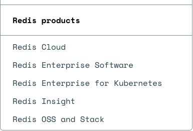
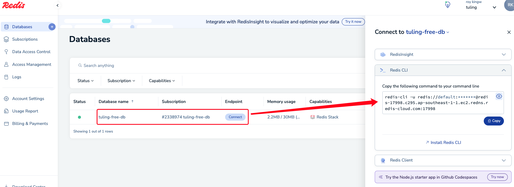
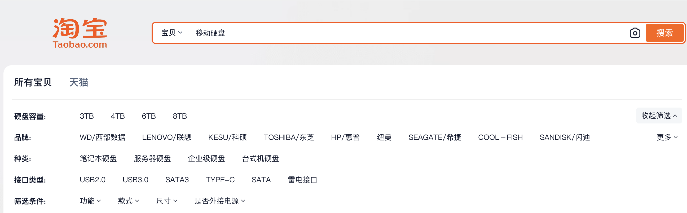
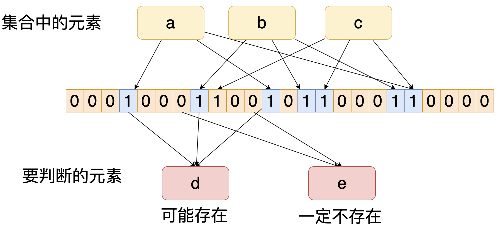

# Redis Stack扩展功能

# 一、了解Redis产品

&#x9;目前，在Redis的官网上，可以看到Redis已经包含了多个产品。



&#x9;其中，Redis Cloud是Redis的云服务，Redis Insight是Redis官方推出的图形化客户端。解决了Redis客户端群龙无首的囧境。

&#x9;而Redis本身，也已经划分成了几个版本。Redis OSS就是我们之前用的Redis。 Redis Stack可以理解为是Redis加上一系列的扩展产品。Redis Enterprise是Redis的企业版。

&#x9;这次我们就一起来体验一下Redis Stack的扩展功能。


# 二、申请RedisCloud实例

&#x9;Redis Stack可以在我们之前安装的Redis服务上，自行下载安装新的扩展模块。在目前阶段，在RedisCloud上可以申请一个免费的RedisStack实例，快速体验Redis Stack的功能。

&#x9;从Redis官网的右上角，就有Redis Cloud的登录链接。目前Redis Cloud提供了多种第三方登录的方式，可以选择合适的方式注册账号。


&#x9;注册登录后，Redis Cloud就会分配一个免费的Redis实例。提供了Redis Stack功能支持。



&#x9;接下来使用命令行，就可以连上这个Redis实例。

> 这个实例空间非常有限，而且无法长期使用。如果有更多需求，可以去了解一下付费版本。基础付费5美元/月


# 三、Redis Stack体验

## 1、RedisStack有哪些扩展？

&#x9;目前Redis的官网上，单独构建了Redis的指令页面。在这个页面可以直接搜索相关的功能。


&#x9;另外， 在redis-cli客户端也可以使用module list指令查看当前Redis服务中有哪些扩展。

&#x9;Redis Stack的这些扩展功能，也可以手动添加到自己的Redis服务中。但是通常并不是必须的。我们可以使用Redis Cloud上的实例先完整体验一下，再考虑要不要使用这些扩展。

&#x9;接下来找几个比较常见的扩展模块，体验一下。


## 2、Redis JSON

### 1、Redis JSON是什么

&#x9;RedisJSON是Redis的一个扩展模块，它提供了对JSON数据的原生支持。通过RedisJSON，我们可以将JSON数据直接存储在Redis中，并利用丰富的命令集进行高效的查询和操作。RedisJSON不仅简化了数据处理的流程，还大幅提升了处理JSON数据的性能。

### 2、Redis JSON有什么用

&#x9;Redis JSON的常用指令，在官网的Commands页面搜索JSON组就能看到

> 在Redis服务端，这些扩展指令并没有严格分组，而是都放在一个叫做module的组
>
> ```shell
> redis-17998.c295.ap-southeast-1-1.ec2.redns.redis-cloud.com:17998> help JSON.SET
>
>   JSON.SET (null)
>   summary: (null)
>   group: module
> ```

&#x9;Redis JSON模块为Redis添加了JSON数据类型的支持，并且对JSON数据提供了快速进行增、删、改、查的操作。

```shell
-- 设置一个JSON数据
JSON.SET user $ '{"name":"loulan","age":18}'
## key是user，value就是一个JSON数据。其中$表示JSON数据的根节点。
-- 查询JSON数据
JSON.GET user
-- 查询JSON对象的name属性
JSON.GET user $.name
-- 查看数据类型
JSON.TYPE user    -- object
JSON.TYPE user $.name   --- string
JSON.TYPE user $.age    --- integer
--修改JSON数据 年龄加2
JSON.NUMINCRBY user $.age 2
-- 添加新的字段
JSON.SET user $.address '{"city": "Changsha", "country": "China"}' NX
## NX 表示只有当address字段不存在的时候才进行设置。
-- 在JSON数组中添加元素
JSON.SET user $.hobbies '["reading"]'
JSON.ARRAPPEND user $.hobbies '"swimming"'
-- 查看JSON对象中key的个数
JSON.OBJLEN user $.address


-- 查看user对象的所有key
JSON.OBJKEYS user

-- 删除JSON中的key
JSON.DEL user $.address
```

### 3、Redis JSON的优势

&#x9;JSON是现代应用程序中经常用到的一种数据类型。很多时候，就算没有Redis JSON插件，我们也会采用JSON格式来缓存复杂的数据类型。比如在分布式场景下做用户登录功能，我们就可以将用户信息以JSON字符串的形式保存到Redis中，来代替单体应用中的Session，从而实现统一的登录状态管理。这些数据使用Redis JSON插件来管理，就显得顺理成章了。

&#x9;并且Redis JSON插件相比用string管理这种JSON数据，还能带来一些很明显的优势。

*   Redis JSON存储数据的性能更高。Redis JSON底层其实是以一种高效的二进制的格式存储。相比简单的文本格式，二进制格式进行JOSN格式读写的性能更高，也更节省内存。根据官网的性能测试报告，使用Redis JSON读写JSON数据，性能已经能够媲美MongoDB以及ElasticSearch等传统NoSQL数据库。
*   Redis JSON使用树状结构来存储JSON。这种存储方式可以快速访问子元素。与传统的文本存储方案相比，树状存储结构能够更高效的执行查询操作。
*   与Redis生态集成度高。作为Redis的扩展模块，Redis JSON和Redis的其他功能和工具无缝集成。这意味着开发者可以继续使用TTL、Redis事务、发布/订阅、Lua脚本等功能。


## 3、Search And Query

&#x9;当Redis中存储的数据比较多时，搜索Redis中的数据是一件比较麻烦的事情。通常使用的 keys \* 这样的指令，在生产环境一般都是直接禁用的，因为这样会产生严重的线程阻塞，影响其他的读写操作。

&#x9;如何快速搜索Redis中的数据(主要是key)呢？ Redis中原生提供了Scan指令，另外在Redis  Stack中也增加了Search And Query模块。

### 1、传统Scan搜索

&#x9;Scan指令的官方介绍：<https://redis.io/docs/latest/commands/scan/>

&#x9;Scan指令的基础思想就是每次只返回想要查询的一部分结果数据，然后通过迭代的方式，逐步返回完整数据。

&#x9;scan指令的基础使用方式：&#x20;

```shell
SCAN cursor [MATCH pattern] [COUNT count] [TYPE type]
```

&#x9;这几个核心参数介绍如下：

*   cursor: 游标。代表每次迭代返回的偏移量。通常一次查询，cursor从0开始，然后scan指令会返回下一次迭代的起始偏移量。用户可以用这个返回值作为cursor，继续迭代下一批。直到cursor返回0，表示所有数据都过滤完成了。
*   pattern：匹配字符串。用来匹配要查询的key。 例如 user\* 表示以user开头的字符串。
*   count：数字，表示每次迭代多少条数据。
*   type是key的类型，比如可以指定string ,set,zset等。

> 另外，针对不同key类型，还有一些不同的指令。 比如 SSCAN针对Set类型。HSCAN针对HASH类型。 ZSCAN针对ZSet类型。

简单示例如下：

```shell
-- 准备数据
eval 'for i = 1,30,1 do redis.call("SET","k"..tostring(i),"v"..tostring(i)) end' 0

--简单按照cursor过滤所有key。
scan 0
1) 18      ## 下一次迭代的cursor
....
scan 18
1) 21
....
scan 21
1) 0       ## 返回0表述所有数据过滤完成
....


-- 按照patern过滤 查询所有k开头的key
scan 0 MATCH k*
1) 18
...
scan 18 MATCH k*
1) 21
...
scan 21 MATCH k* 
1) 0

-- 设置迭代次数
scan 0 MATCH k* count 20
1) 21
...
scan 21 MATCH k* count 20
1) 0
```

### 2、Search And Query搜索

&#x9;传统的SCAN搜索方式，只能简单的过滤Key。如果想要做一些复杂的搜索，就力不从心了。

&#x9;比如在电商场景中，我们通常会用Redis来缓存商品信息，但是如果要做按品牌、型号、价格等等各种条件过滤商品的场景，Redis就不够用了。以往我们会选择将商品数据导入到MongoDB或者ElasticSearch这样的搜索引擎进行复杂过滤。



&#x9;而Redis提供了RedisSearch插件，基本就可以认为是ElasticSearch这类搜索引擎的平替。大部分ES能够实现的搜索功能，在Redis里就能直接进行。这样就极大的减少了数据迁移带来的麻烦。

&#x9;既然要做搜索，那就需要有能够支持搜索的数据结构。 Redis的哪些数据结构能够支持结构化查询呢？只有HASH和JSON。

```shell
--清空数据
flushall
-- 创建一个产品的索引
FT.CREATE productIndex ON JSON SCHEMA $.name AS name TEXT $.price AS price NUMERIC
## 索引为productIndex. 
## ON JSON 表示 这个索引会基于JSON数据构建，需要RedisJSON模块的支持。默认是ON HASH 表示检索所有HASH格式的数据
## SCHEMA表示根据哪些字段建立索引。  字段名 AS 索引字段名 数据类型  这样的组合。如果是JSON格式，字段名用$. 路径表示

-- 模拟一批产品信息
JSON.SET phone:1 $ '{"id":1,"name":"HUAWEI 1","description":"HUAWEI PHONE 1","price":1999}'
JSON.SET phone:2 $ '{"id":2,"name":"HUAWEI 2","description":"HUAWEI PHONE 2","price":2999}'
JSON.SET phone:3 $ '{"id":3,"name":"HUAWEI 3","description":"HUAWEI PHONE 3","price":3999}'
JSON.SET phone:4 $ '{"id":4,"name":"HUAWEI 4","description":"HUAWEI PHONE 4","price":4999}'
JSON.SET phone:5 $ '{"id":5,"name":"HUAWEI 5","description":"HUAWEI PHONE 5","price":5999}'
JSON.SET phone:6 $ '{"id":6,"name":"HUAWEI 6","description":"HUAWEI PHONE 6","price":6999}'
JSON.SET phone:7 $ '{"id":7,"name":"HUAWEI 7","description":"HUAWEI PHONE 7","price":7999}'
JSON.SET phone:8 $ '{"id":8,"name":"HUAWEI 8","description":"HUAWEI PHONE 8","price":8999}'
JSON.SET phone:9 $ '{"id":9,"name":"HUAWEI 9","description":"HUAWEI PHONE 9","price":9999}'
JSON.SET phone:10 $ '{"id":10,"name":"HUAWEI 10","description":"HUAWEI PHONE 10","price":19999}'

## 如果是ON HASH ，可以直接通过索引添加数据
## FT.ADD productIndex 'product:1'  1.0 FIELDS "id" 1 "name" "HUAWEI1" "description" "HUAWEI PHONE 1" "PRICE" 3999
## 数据的key 是producr:1 
## FIELDS 数据。 按照 key value 的格式组织 

-- 查看索引状态
FT.INFO productIndex

-- 搜索产品 
## 搜索条件: name包含 HUAWEI， price在1000到5000之间。返回id和name
FT.SEARCH productIndex "@name:HUAWEI @price:[1000 5000]" RETURN 2 id name
## 查询条件构建，参见官网 https://redis.io/docs/latest/develop/interact/search-and-query/query/
```

## 4、Bloom Filter

### 1、布隆过滤器是什么

&#x9;一句话解释：一种快速检索一个元素是否在一个海量集合中的算法。

&#x9;比如现在有一个签到活动，要求每个用户只能签到一次，重复签到无效。这种常见的需求怎么做？如果不考虑数量级，那么非常简单。把所有签到的用户ID存到一个集合里。签到前到集合里检查一下用户ID有没有就可以了。

&#x9;但是，如果你要面对的是淘宝的海量用户信息呢？这个集合得要多大？在一个海量集合里检索一个数据，是不是很慢？这就需要一个更节省空间同时更高效的算法，能够在海量数据集合中快速判断一个元素存不存在。这就可以用布隆过滤器。

&#x9;布隆过滤器的使用场景非常多，最典型的应用是作为缓存数据的前端过滤缓存。快速比如，在淘宝这种海量用户的登录场景，也可以用布隆过滤器，快速判断用户输入的用户名是不是存在。如果用户名不存在，那么就可以直接拒绝，不再需要去数据库里查了。这样就可以防止大部分无效数据查询，屏蔽很多恶意的请求。

&#x9;布隆过滤器使用一个很长的二进制位数组和一系列哈希函数来保存元素。优点是非常节省空间，并且查询时间也非常快。缺点是有一定的误失败概率以及无法删除元素 ，也无法给元素计数。

*   位数组（Bit Array）：布隆过滤器使用一个长度固定的位数组来存储数据。每个位置只占用一个比特（0或1），初始时所有位都设置为0。位数组的长度和哈希函数的数量决定了过滤器的误报率和容量。
*   哈希函数集合：布隆过滤器使用多个哈希函数，每个函数都会将输入数据映射到位数组的一个不同位置。哈希函数的选择对过滤器的性能有很大影响，理想的哈希函数应该具有良好的散列性，使得不同的输入尽可能均匀地映射到位数组的不同位置。&#x20;



&#x9;布隆过滤器判断一个元素不在集合中，那么这个元素肯定不在集合中。但是，布隆过滤器判断一个元素在集合中，那么这个元素有可能不在集合中。


### 2、Guava的布隆过滤器示例

&#x9;布隆过滤器中，将一个原本不在集合中的元素判断成为在集合中，这就是误判。而误判率是布隆过滤器一个很重要的控制指标。

&#x9;在算法实现时，误判率是可以通过设定更复杂的哈希函数组合以及做更大的位数组来进行控制的。所以，在布隆过滤器的初始化过程中，通常只需要指定过滤器的容量和误判率，就足够了。

&#x9;pom.xml引入Guava

```xml
<dependency>
  <groupId>com.google.guava</groupId>
  <artifactId>guava</artifactId>
  <version>33.1.0-jre</version>
</dependency>
```

&#x9;使用Guava提供的布隆过滤器实现

```java
public static void main(String[] args) {
    BloomFilter<String> bloomFilter = BloomFilter.create(Funnels.stringFunStandardCharsets.UTF_8),10000,0.0
    //把 A~Z 放入布隆过滤器
    for (int i = 64; i <= 90 ; i++) {
       bloomFilter.put(String.valueOf((char) i));
    }
    System.out.println(bloomFilter.mightContain("A")); //true
    System.out.println(bloomFilter.mightContain("a")); //false
}
```