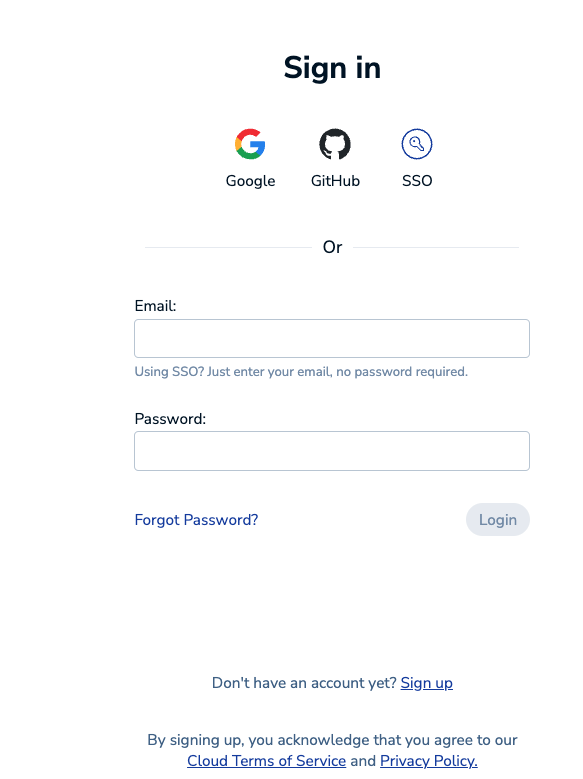
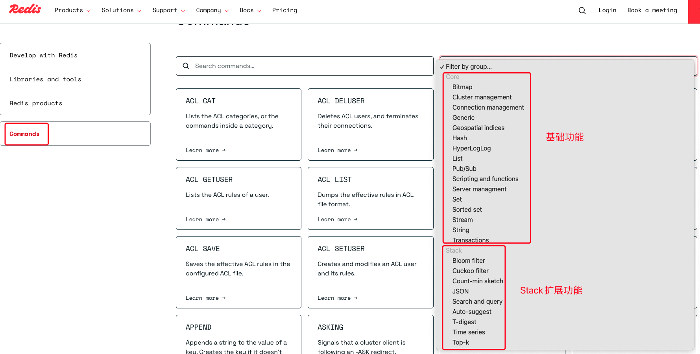

# Redis Stack扩展功能

# 一、了解Redis产品

&#x9;目前，在Redis的官网上，可以看到Redis已经包含了多个产品。


&#x9;其中，Redis Cloud是Redis的云服务，Redis Insight是Redis官方推出的图形化客户端。解决了Redis客户端群龙无首的囧境。

&#x9;而Redis本身，也已经划分成了几个版本。Redis OSS就是我们之前用的Redis。 Redis Stack可以理解为是Redis加上一系列的扩展产品。Redis Enterprise是Redis的企业版。

&#x9;这次我们就一起来体验一下Redis Stack的扩展功能。


# 二、申请RedisCloud实例

&#x9;Redis Stack可以在我们之前安装的Redis服务上，自行下载安装新的扩展模块。在目前阶段，在RedisCloud上可以申请一个免费的RedisStack实例，快速体验Redis Stack的功能。

&#x9;从Redis官网的右上角，就有Redis Cloud的登录链接。目前Redis Cloud提供了多种第三方登录的方式，可以选择合适的方式注册账号。



&#x9;注册登录后，Redis Cloud就会分配一个免费的Redis实例。提供了Redis Stack功能支持。


&#x9;接下来使用命令行，就可以连上这个Redis实例。

> 这个实例空间非常有限，而且无法长期使用。如果有更多需求，可以去了解一下付费版本。基础付费5美元/月


# 三、Redis Stack体验

## 1、RedisStack有哪些扩展？

&#x9;目前Redis的官网上，单独构建了Redis的指令页面。在这个页面可以直接搜索相关的功能。



&#x9;另外， 在redis-cli客户端也可以使用module list指令查看当前Redis服务中有哪些扩展。

&#x9;Redis Stack的这些扩展功能，也可以手动添加到自己的Redis服务中。但是通常并不是必须的。我们可以使用Redis Cloud上的实例先完整体验一下，再考虑要不要使用这些扩展。

&#x9;接下来找几个比较常见的扩展模块，体验一下。


## 2、Redis JSON

### 1、Redis JSON是什么

&#x9;RedisJSON是Redis的一个扩展模块，它提供了对JSON数据的原生支持。通过RedisJSON，我们可以将JSON数据直接存储在Redis中，并利用丰富的命令集进行高效的查询和操作。RedisJSON不仅简化了数据处理的流程，还大幅提升了处理JSON数据的性能。

### 2、Redis JSON有什么用

&#x9;Redis JSON的常用指令，在官网的Commands页面搜索JSON组就能看到

> 在Redis服务端，这些扩展指令并没有严格分组，而是都放在一个叫做module的组
>
> ```shell
> redis-17998.c295.ap-southeast-1-1.ec2.redns.redis-cloud.com:17998> help JSON.SET
>
>   JSON.SET (null)
>   summary: (null)
>   group: module
> ```

&#x9;Redis JSON模块为Redis添加了JSON数据类型的支持，并且对JSON数据提供了快速进行增、删、改、查的操作。

```shell
-- 设置一个JSON数据
JSON.SET user $ '{"name":"loulan","age":18}'
## key是user，value就是一个JSON数据。其中$表示JSON数据的根节点。
-- 查询JSON数据
JSON.GET user
-- 查询JSON对象的name属性
JSON.GET user $.name
-- 查看数据类型
JSON.TYPE user    -- object
JSON.TYPE user $.name   --- string
JSON.TYPE user $.age    --- integer
--修改JSON数据 年龄加2
JSON.NUMINCRBY user $.age 2
-- 添加新的字段
JSON.SET user $.address '{"city": "Changsha", "country": "China"}' NX
## NX 表示只有当address字段不存在的时候才进行设置。
-- 在JSON数组中添加元素
JSON.SET user $.hobbies '["reading"]'
JSON.ARRAPPEND user $.hobbies '"swimming"'
-- 查看JSON对象中key的个数
JSON.OBJLEN user $.address


-- 查看user对象的所有key
JSON.OBJKEYS user

-- 删除JSON中的key
JSON.DEL user $.address
```

### 3、Redis JSON的优势

&#x9;JSON是现代应用程序中经常用到的一种数据类型。很多时候，就算没有Redis JSON插件，我们也会采用JSON格式来缓存复杂的数据类型。比如在分布式场景下做用户登录功能，我们就可以将用户信息以JSON字符串的形式保存到Redis中，来代替单体应用中的Session，从而实现统一的登录状态管理。这些数据使用Redis JSON插件来管理，就显得顺理成章了。

&#x9;并且Redis JSON插件相比用string管理这种JSON数据，还能带来一些很明显的优势。

*   Redis JSON存储数据的性能更高。Redis JSON底层其实是以一种高效的二进制的格式存储。相比简单的文本格式，二进制格式进行JOSN格式读写的性能更高，也更节省内存。根据官网的性能测试报告，使用Redis JSON读写JSON数据，性能已经能够媲美MongoDB以及ElasticSearch等传统NoSQL数据库。
*   Redis JSON使用树状结构来存储JSON。这种存储方式可以快速访问子元素。与传统的文本存储方案相比，树状存储结构能够更高效的执行查询操作。
*   与Redis生态集成度高。作为Redis的扩展模块，Redis JSON和Redis的其他功能和工具无缝集成。这意味着开发者可以继续使用TTL、Redis事务、发布/订阅、Lua脚本等功能。