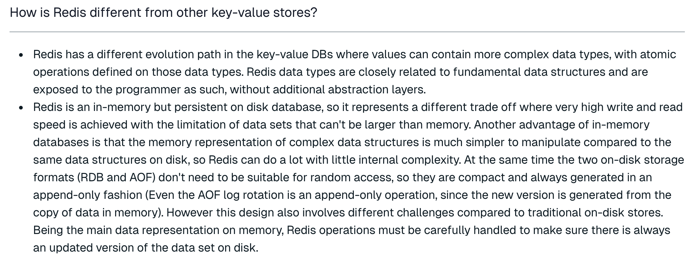
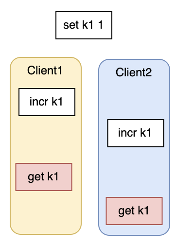
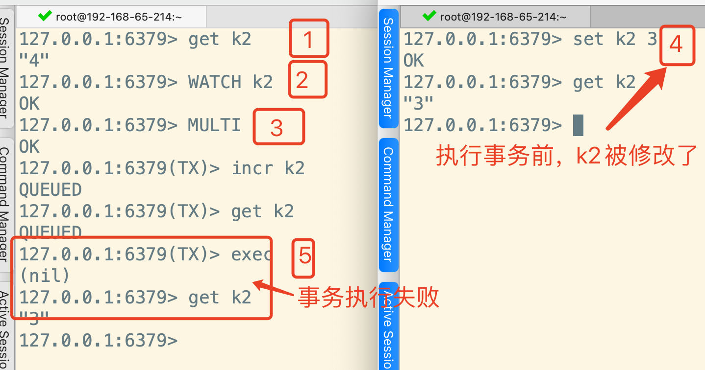
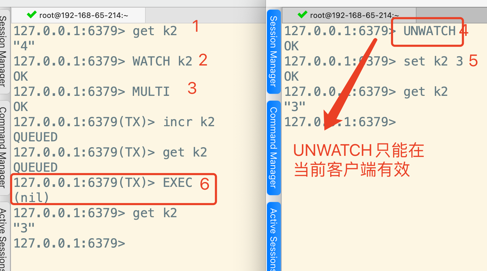
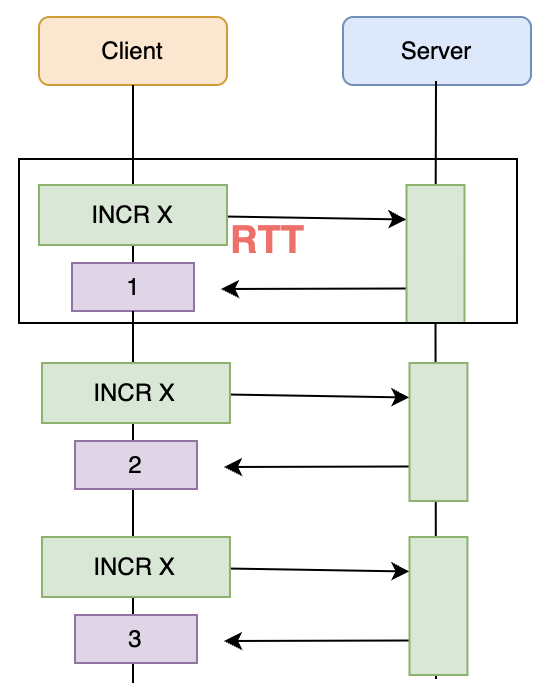
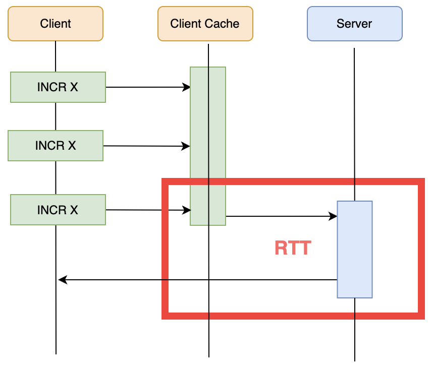
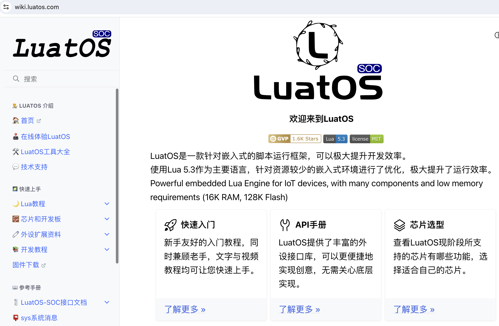

# 深入理解Redis线程模型


# 一、Redis是什么？有什么用？

## 1、Redis是什么？

&#x9;关于Redis，你一定或多或少听说过，互联网集中式缓存的代名词。但是，2024年了，Redis到底是什么呢？

&#x9;Redis 全称 REmote DIctionary Server，远程字典服务，是一个完全开源的，高性能的Key-Value数据库。官网地址： <https://redis.io/> 。引用官网上的一个问答，带你重新了解下Redis。



&#x9;核心总结：

*   数据结构复杂。

Redis相比于传统的K-V型数据库，能够支撑更更复杂的数据类型。这意味着Redis已经远远超出了缓存的范围，可以实现很多复杂的业务场景。并且还在不断发展更多的业务场景。

*   数据保存在内存，但是持久化到硬盘。

数据全部保存在内存，意味着Redis进行数据读和写的性能非常高。是集中式缓存的不二之选。

数据持久化到硬盘，意味着Redis上保存的数据是非常安全的。目前Redis完全可以当做一个数据库来用。

&#x9;所以，官方对Redis的作用，也已经定位成了三个方面：Cache(缓存)，Database(数据库)，Vector Search(向量搜索)


> 截图来自于Redis Cloud

## 2、2024年的Redis是什么样的？

&#x9;在2023年之前，Redis是一个纯粹的开源数据库。但是，在最近的这两年，Redis正在进行华丽的蜕变。从一个缓存产品变成一整套生态服务。


&#x9;其中，Redis Cloud是一套云服务，基于AWS，Azure等公有云，提供了一整套完整的企业服务。 并提供了Redis Enterprise，企业级的收费产品服务。

&#x9;Redis Insight是一套Redis服务的安装及管理套件。可以简单理解为是Redis官方推出的一个图形化客户端。以往使用Redis都需要寻找各种第三方的客户端，现在不用了。并且Redis Insight也可以在Redis Cloud上直接使用。

&#x9;而在功能层面。目前已经形成了Redis OSS和Redis Stack两套服务体系。 其中Redis OSS就是以前常用的开源的服务体系。而Redis Stack可以认为是基于Redis OSS打造的一套更完整的技术栈。基于Redis Cloud提供服务，在Redis OSS功能的基础上，提供了很多高级的扩展功能。


# 二、Redis到底是单线程还是多线程？

&#x9;这是Redis面试过程中最喜欢问的问题。几乎伴随着Redis的整个发展过程。

&#x9;**首先：整体来说，Redis的整体线程模型可以简单解释为 客户端多线程，服务端单线程**

&#x9;Redis为了能够与更多的客户端进行连接，还是使用的多线程来维护与客户端的Socket连接。在redis.conf中就有一个参数maxclients维护了最大的客户端连接数

```conf
# Redis is mostly single threaded, however there are certain threaded
# operations such as UNLINK, slow I/O accesses and other things that are
# performed on side threads.
#
# Now it is also possible to handle Redis clients socket reads and writes
# in different I/O threads. Since especially writing is so slow, normally
# Redis users use pipelining in order to speed up the Redis performances per
# core, and spawn multiple instances in order to scale more. Using I/O
# threads it is possible to easily speedup two times Redis without resorting
# to pipelining nor sharding of the instance.
#
# By default threading is disabled, we suggest enabling it only in machines
# that have at least 4 or more cores, leaving at least one spare core.
# Using more than 8 threads is unlikely to help much. We also recommend using
# threaded I/O only if you actually have performance problems, with Redis
# instances being able to use a quite big percentage of CPU time, otherwise
# there is no point in using this feature.
#
# So for instance if you have a four cores boxes, try to use 2 or 3 I/O
# threads, if you have a 8 cores, try to use 6 threads. In order to
# enable I/O threads use the following configuration directive:
#
# io-threads 4

# Set the max number of connected clients at the same time. By default
# this limit is set to 10000 clients, however if the Redis server is not
# able to configure the process file limit to allow for the specified limit
# the max number of allowed clients is set to the current file limit
# minus 32 (as Redis reserves a few file descriptors for internal uses).
#
# Once the limit is reached Redis will close all the new connections sending
# an error 'max number of clients reached'.
#
# IMPORTANT: When Redis Cluster is used, the max number of connections is also
# shared with the cluster bus: every node in the cluster will use two
# connections, one incoming and another outgoing. It is important to size the
# limit accordingly in case of very large clusters.
#
# maxclients 10000
```

&#x9;但是，在服务端，Redis响应网络IO和键值对读写的请求，则是由一个单独的主线程完成的。Redis基于epoll实现了IO多路复用，这就可以用一个主线程同时响应多个客户端Socket连接的请求。


&#x9;在这种线程模型下，Redis将客户端多个并发的请求转成了串行的执行方式。因此，在Redis中，完全不用考虑诸如MySQL的脏读、幻读、不可重复读之类的并发问题。并且，这种串行化的线程模型，加上Redis基于内存工作的极高性能，也让Redis成为很多并发问题的解决工具。

&#x9;**然后，严格来说，Redis后端的线程模型跟Redis的版本是有关系的。**

&#x9;Redis4.X以前的版本，都是采用的纯单线程。但是在2018年10月份，Redis5.x版本进行了一次大的核心代码重构。 到Redis6.x和7.x版本中，开始用一种全新的多线程机制来提升后台工作。尤其在现在的Redis7.x版本中，Redis后端的很多比较费时的操作，比如持久化RDB，AOF文件、unlink异步删除、集群数据同步等，都是由额外的线程执行的。例如，对于 FLUSHALL操作，就已经提供了异步的方式。


> 实际上，现代CPU早就是多核架构了，Redis如果一直使用单线程，就不能发挥多核CPU的性能优势，迟早是跟不上时代的。并且那些非常耗时的操作，也必然会对主线程产生影响。所以，多线程是一个必然结果。只不过，对于Redis来说，为了保持快速，多线程会走得非常谨慎。
>
> Redis一直保持核心线程的单线程模型，其实是因为对于现代的Redis来说，CPU通常不会成为Redis的性能瓶颈。影响Redis的性能瓶颈大部分是内存和网络。因此，核心线程改为多线程的要求并不急切。另外，Redis的这种单线程为主的工作机制还可以减少线程上下文切换的性能消耗。而且，如果Redis将核心线程改为多线程并发执行，那么就必然带来资源竞争，反而会极大增加Redis的业务复杂性，影响Redis的业务执行效率。


# 三、Redis如何保证指令原子性

&#x9;对于核心的读写键值的操作，Redis是单线程处理的。如果多个客户端同时进行读写请求，Redis只会排队串行。也就是说，针对单个客户端，Redis并没有类似MySQL的事务那样保证同一个客户端的操作原子性。像下面这种情况，返回的k1的值，就很难确定。



&#x9;如何控制Redis指令的原子性呢？这是一系列的问题，在不同的业务场景下，Redis也提供了不同的思路。我们需要在项目中能够灵活选择。

## 1、复合指令

&#x9;Redis内部提供了很多复合指令，他们是一个指令，可是明显干着多个指令的活。 比如 MSET(HMSET)、GETSET、SETNX、SETEX。这些复合指令都能很好的保持原子性。

## 2、Redis事务

&#x9;像MySQL一样，Redis也提供了事务机制。&#x9;

```shell
127.0.0.1:6379> help @transactions

  DISCARD (null)  -- 放弃事务
  summary: Discards a transaction.
  since: 2.0.0

  EXEC (null)  -- 执行事务
  summary: Executes all commands in a transaction.
  since: 1.2.0

  MULTI (null)  -- 开启事务
  summary: Starts a transaction.
  since: 1.2.0

  UNWATCH (null)  --去掉监听
  summary: Forgets about watched keys of a transaction.
  since: 2.2.0

  WATCH key [key ...]   --监听某一个key的变化。key有变化后，就执行当前事务
  summary: Monitors changes to keys to determine the execution of a transaction.
  since: 2.2.0
```

&#x9;使用方式也很典型，开启事务后，接入一系列操作，然后根据执行情况选择是执行事务还是回滚事务。例如

```shell
127.0.0.1:6379> MULTI
OK
127.0.0.1:6379(TX)> set k2 2
QUEUED
127.0.0.1:6379(TX)> incr k2
QUEUED
127.0.0.1:6379(TX)> get k2
QUEUED
127.0.0.1:6379(TX)> EXEC  --执行事务
1) OK
2) (integer) 3
3) "3"
127.0.0.1:6379> DISCARD  -- 放弃事务
```

&#x9;但是，这和数据库中的事务，是不是同一回事呢？看下面这个例子。

```shell
127.0.0.1:6379> MULTI
OK
127.0.0.1:6379(TX)> set k2 2
QUEUED
127.0.0.1:6379(TX)> incr k2
QUEUED
127.0.0.1:6379(TX)> get k2
QUEUED
127.0.0.1:6379(TX)> lpop k2
QUEUED
127.0.0.1:6379(TX)> incr k2
QUEUED
127.0.0.1:6379(TX)> get k2
QUEUED
127.0.0.1:6379(TX)> exec
1) OK
2) (integer) 3
3) "3"
4) (error) WRONGTYPE Operation against a key holding the wrong kind of value
5) (integer) 4
6) "4"
```

&#x9;lpop指令是针对list的操作，现在针对string类型的k2操作，那么肯定会报错。 但是，结果是这行错误的指令并没有让整个事务回滚，甚至后面的指令都没有受到影响。

&#x9;从这里可以看到。Redis的事务并不是像数据库的事务那样，保证事务中的指令一起成功或者一起失败。Redis的事务作用，仅仅只是保证事务中的原子操作是一起执行，而不会在执行过程中被其他指令加塞。

> 实际上，在事务指令敲击的过程中可以看到， 开启事务后，所有操作的返回结果都是QUEUED，表示这些操作只是排好了队，等到EXEC后一起执行。

&#x9;对于Redis事务的更多说明，参见官网 <https://redis.io/docs/latest/develop/interact/transactions/>

> 注意：redis官网发生了非常大的变化，所以具体地址以官网实际情况为准。

&#x9;核心重点做几个总结：

**1、Redis事务可以通过Watch机制进一步保证在某个事务执行前，某一个key不被修改。**



&#x9;注意：UNWATCH取消监听，只在当前客户端有效。比如下图。 只有在左侧客户端步骤3之前执行UNWATCH才能让事务执行成功。在右侧客户端执行UNWATCH是不生效的。



**2、Redis事务失败如何回滚**

&#x9;Redis中的事务回滚，不是回滚数据，而是回滚操作。

&#x9;1》如果事务是在EXEC执行前失败(比如事务中的指令敲错了，或者指令的参数不对)，那么整个事务的操作都不会执行。

&#x9;2》如果事务是在EXEC执行之后失败(比如指令操作的key类型不对)，那么事务中的其他操作都会正常执行，不受影响。

**3、事务执行过程中出现失败了怎么办**

&#x9;1》只要客户端执行了EXEC指令，那么就算之后客户端的连接断开了，事务就会一直进行下去。

&#x9;2》事务有可能造成数据不一致。当EXEC指令执行后，Redis会先将事务中的所有操作都先记录到AOF文件中，然后再执行具体的操作。这时有一种可能，Redis保存了AOF记录后，事务的操作在执行过程中，服务就出现了非正常宕机(服务崩溃了，或者执行进程被kill -9了)。这就会造成AOF中记录的操作，与数据不符合。如果Redis发现这种情况，那么在下次服务启动时，就会出现错误，无法正常启动。这时，就要使用redis-check-aof工具修复AOF文件，将这些不完整的事务操作记录移除掉。这样下次服务就可以正常启动了。

**4、事务机制优缺点，什么时候用事务**

&#x9;！！！没有标准答案，自行总结。

## 3、Pipeline

**1、什么是管道**

&#x9;redis-cli指令天天用，你有没有试过用redis-cli --help指令看看这个客户端指令有哪些用法？其中就有两个不起眼的东东

```shell
  --pipe             Transfer raw Redis protocol from stdin to server.
  --pipe-timeout <n> In --pipe mode, abort with error if after sending all data.
                     no reply is received within <n> seconds.
                     Default timeout: 30. Use 0 to wait forever.
```

**2、使用案例**

&#x9;在Linux上编辑一个文件 command.txt。文件中可以包含一系列的指令

```shell
set count 1
incr count
incr count
incr count
```

&#x9;然后在客户端执行redis-cli指令时，就可以直接执行这个文件中的指令。

```shell
[root@192-168-65-214 ~]# cat command.txt | redis-cli -a 123qweasd --pipe
Warning: Using a password with '-a' or '-u' option on the command line interface may not be safe.
All data transferred. Waiting for the last reply...
Last reply received from server.
errors: 0, replies: 4
[root@192-168-65-214 ~]# redis-cli -a 123qweasd
Warning: Using a password with '-a' or '-u' option on the command line interface may not be safe.
127.0.0.1:6379> get count
"4"
```

**3、有什么用**

&#x9;结论：如果你有大批量的数据需要快速写入到Redis中，这种方式可以一定程度提高执行效率

&#x9;具体参考官网：<https://redis.io/docs/latest/develop/use/pipelining/>

&#x9;核心作用：优化RTT(round-trip time)

&#x9;RTT是什么鬼？

&#x9;当客户端执行一个指令，数据包需要通过网络从Client传到Server，然后再从Server返回到Client。这个中间的时间消耗，就称为RTT(Rount Trip Time)。



&#x9;可以看到，如果客户端的指令非常频繁，那么RTT消耗就会非常可观。有没有办法优化RTT呢？Redis提供了pipeline机制。其思路也比较简单明了。就是将客户端的多个指令打包，一起往服务端推送。



&#x9;这种实现方式，就是pipeline。例如官网就给出了一个案例：

```shell
[root@192-168-65-214 ~]# printf "AUTH 123qweasd\r\nPING\r\nPING\r\nPING\r\n" | nc localhost 6379
+OK
+PONG
+PONG
+PONG
```

> 有没有尝试理解Redis客户端干了些什么事情？后面还会继续分析。

**4、pipeline注意点**

&#x9;redis的原生复合指令和事务，都是原子性的。但是pipeline不具备原子性。pipeline只是将多条命令发送到服务端，最终还是可能会被其他客户端的指令加塞的，虽然这种概率通常比较小。所以在pipeline中通常不建议进行复杂的数据操作。同时，这也表明，执行复合指令和事务，会阻塞其他命令执行，而执行pipeline不会。

&#x9;pipeline的执行需要客户端和服务端同时完成，pipeline在执行过程中，会阻塞当前客户端。在pipeline中不建议拼装过多的指令。因为指令过多，会使客户端阻塞时间太长，同时服务端需要回复这个很繁忙的客户端，占用很多内存。

&#x9;总体来说，pipeline机制适合做一些在非热点时段进行的数据调整任务。

## 4、lua脚本

&#x9;Redis的事务和Pipelinie机制，对于Redis的指令原子性问题，都有一定的帮助，但是，从之前的分析可以看到，这两个机制对于指令原子性问题都有水土不服的地方。并且，他们都只是对Redis现有指令进行拼凑，无法添加更多自定义的复杂逻辑。因此，企业中用到更多的是lua脚本。同时，也是Redis7版本着重调整的一个功能。

**1、什么是lua？为什么Redis支持lua？**

&#x9;lua是一种小巧的脚本语言，他拥有很多高级语言的特性。比如参数类型、作用域、函数等。lua的语法非常简单，熟悉Java后基本上可以零门槛上手lua。

> 如果你对lua原生的语法感兴趣，推荐一个参考网站：<https://wiki.luatos.com/>  这个网站可以直接在线调试lua语法，简单轻松无压力。
>


注：Redis 7.x版本支持的lua语言是5.1版本。而这个网站支持的是5.3版本。

&#x9;lua语言最大的特点是他的线程模型是单线程的模式。这使得lua天生就非常适合一些单线程模型的中间件。比如Redis,Nginx等都非常适合接入lua语言进行功能定制。所以，在Redis中执行一段lua脚本，天然就是原子性的。

**2、Redis中如何执行lua？**

&#x9;Redis中对lua语言的API介绍参考官网： <https://redis.io/docs/latest/develop/interact/programmability/lua-api/>

&#x9;Redis中对lua支持从2.6.0版本就已经开始了。具体参考指令可以使用 help eval指令查看

```shell
127.0.0.1:6379> help eval

  EVAL script numkeys [key [key ...]] [arg [arg ...]]
  summary: Executes a server-side Lua script.
  since: 2.6.0
  group: scripting
```

*   script参数是一段Lua脚本程序，它会被运行在Redis服务器上下文中，这段脚本不必(也不应该)定义为一 个Lua函数。
*   numkeys参数用于指定键名参数的个数。键名参数 key \[key ...] 从EVAL的第三个参数开始算 起，表示在脚本中所用到的那些Redis键(key)，这些键名参数可以在 Lua中通过全局变量KEYS数组，用1 为基址的形式访问( KEYS\[1] ， KEYS\[2] ，以此类推)。&#x20;
*   在命令的最后，那些不是键名参数的附加参数 arg \[arg ...] ，可以在Lua中通过全局变量ARGV数组访问， 访问的形式和KEYS变量类似( ARGV\[1] 、 ARGV\[2] ，诸如此类)。

例如&#x9;

```shell
127.0.0.1:6379> eval "return {KEYS[1],KEYS[2],ARGV[1],ARGV[2]}" 2 key1 key2 first second
1) "key1"
2) "key2"
3) "first"
4) "second"
```

&#x9;在lua脚本中，可以使用redis.call函数来调用Redis的命令。

```shell
127.0.0.1:6379> set stock_1 1
OK
-- 调整1号商品的库存。如果库存小于10，就设置为10
127.0.0.1:6379> eval "local initcount = redis.call('get', KEYS[1]) local a = tonumber(initcount) local b = tonumber(ARGV[1]) if a >= b then redis.call('set', KEYS[1], a) return 1 end redis.call('set', KEYS[1], b) return 0 " 1 "stock_1" 10
(integer) 0
127.0.0.1:6379> get stock_1
"10"
```

注：注意其中keys和args是如何传参的。

**3、使用lua注意点**

&#x9;1》不要在Lua脚本中出现死循环和耗时的运算，否则redis会阻塞，将不接受其他的命令。相比之下，管道pipeline不会阻塞redis。

&#x9;Redis中有一个配置参数来控制Lua脚本的最长控制时间。默认5秒钟。当lua脚本执行时间超过了这个时长，Redis会对其他操作返回一个BUSY错误，而不会一直阻塞。

```conf
################ NON-DETERMINISTIC LONG BLOCKING COMMANDS #####################

# Maximum time in milliseconds for EVAL scripts, functions and in some cases
# modules' commands before Redis can start processing or rejecting other clients.
#
# If the maximum execution time is reached Redis will start to reply to most
# commands with a BUSY error.
#
# In this state Redis will only allow a handful of commands to be executed.
# For instance, SCRIPT KILL, FUNCTION KILL, SHUTDOWN NOSAVE and possibly some
# module specific 'allow-busy' commands.
#
# SCRIPT KILL and FUNCTION KILL will only be able to stop a script that did not
# yet call any write commands, so SHUTDOWN NOSAVE may be the only way to stop
# the server in the case a write command was already issued by the script when
# the user doesn't want to wait for the natural termination of the script.
#
# The default is 5 seconds. It is possible to set it to 0 or a negative value
# to disable this mechanism (uninterrupted execution). Note that in the past
# this config had a different name, which is now an alias, so both of these do
# the same:
# lua-time-limit 5000
# busy-reply-threshold 5000
```

&#x9;2》尽量使用只读脚本

&#x9;只读脚本是Redis7中新增的一种脚本执行方法，表示那些不修改Redis数据集的只读脚本。需要在脚本上加上一个只读的标志，并通过指令EVAL\_RO触发。在只读脚本中不允许执行任何修改数据集的操作，并且可以随时使用SCRIPT\_KILL指令停止。

&#x9;使用只读脚本的好处一方面在于可以限制某些用户的操作。另一方面，这些只读脚本通常都可以转移到备份节点执行，从而减轻Redis的压力。

&#x9;3》热点脚本可以缓存到服务端

```shell
redis> SCRIPT LOAD "return 'Immabe a cached script'"
"c664a3bf70bd1d45c4284ffebb65a6f2299bfc9f"
redis> EVALSHA c664a3bf70bd1d45c4284ffebb65a6f2299bfc9f 0
"Immabe a cached script"
```

## 5、Redis Function

**1、什么是Function**

&#x9;如果你觉得开发lua脚本有困难，那么在Redis7之后，提供了另外一种让程序员解脱的方法-Redis Function。

&#x9;Redis Function允许将一些功能声明成一个统一的函数，提前加载到Redis服务端(可以由熟悉Redis的管理员加载)。客户端可以直接调用这些函数，而不需要再去开发函数的具体实现。

&#x9;Redis Function更大的好处在于在Function中可以嵌套调用其他Function，从而更有利于代码复用。相比之下，lua脚本就无法进行复用。

**2、Function案例**

&#x9;例如，可以在服务器上新增一个mylib.lua文件。在文件中定义函数。

```lua
#!lua name=mylib

local function my_hset(keys, args)
  local hash = keys[1]
  local time = redis.call('TIME')[1]
  return redis.call('HSET', hash, '_last_modified_', time, unpack(args))
end

redis.register_function('my_hset', my_hset)
```

> 注意，脚本第一行是指定函数的命名空间，不是注释，不能少！！！

&#x9;然后，就可以使用Redis客户端，将这个函数加载到Redis中。

```shell
[root@192-168-65-214 myredis]# cat mylib.lua | redis-cli -a 123qweasd -x FUNCTION LOAD REPLACE
Warning: Using a password with '-a' or '-u' option on the command line interface may not be safe.
"mylib"
```

&#x9;这样，在Redis中，其他客户端就可以直接调用这个函数。函数的调用以及传参方式，跟lua脚本是一样的。

```shell
127.0.0.1:6379> FUNCTION LIST
1) 1) "library_name"
   2) "mylib"
   3) "engine"
   4) "LUA"
   5) "functions"
   6) 1) 1) "name"
         2) "my_hset"
         3) "description"
         4) (nil)
         5) "flags"
         6) (empty array)
127.0.0.1:6379> FCALL my_hset 1 myhash myfield "some value" another_field "another value"
(integer) 3
127.0.0.1:6379> HGETALL myhash
1) "_last_modified_"
2) "1717748001"
3) "myfield"
4) "some value"
5) "another_field"
6) "another value"
```

**3、Function注意点**

&#x9;1》Function同样也可以进行只读调用。&#x20;

&#x9;2》如果在集群中使用Function，目前版本需要在各个节点都手动加载一次。Redis不会在集群中进行Function同步

&#x9;3》Function是要在服务端缓存的，所以不建议使用太多太大的Function。

&#x9;4》Function和Script一样，也有一系列的管理指令。使用指令 help @scripting 自行了解。

## 6、Redis指令原子性总结

&#x9;以上介绍的各种机制，其实都是Redis改变指令执行顺序的方式。在这几种工具中，Lua脚本通常会是项目中用得最多的方式。在很多追求极致性能的高并发场景，Lua脚本都会担任很重要的角色。但是其他的各种方式你也需要有了解，这样面临真实业务场景，你才有更多的方案可以选择。

# 四、Redis中的Bigkey问题

&#x9;Bigkey指那些占用空间非常大的key。比如一个list中包含200W个元素，或者一个string里放一篇文章。基于Redis的单线程为主的核心工作机制，这些Bigkey非常容易造成Redis的服务阻塞。因此在实际项目中，一定需要特殊关照。

&#x9;在Redis客户端指令中，提供了两个扩展参数，可以帮助快速发现这些BigKey

```shell
[root@192-168-65-214 myredis]# redis-cli --help
...
 --bigkeys          Sample Redis keys looking for keys with many elements (complexity).
 --memkeys          Sample Redis keys looking for keys consuming a lot of memory.
```

# 五、总结

&#x9;Redis的线程模型整体还是多线程的，只是后台执行指令的核心线程是单线程的。整个线程模型可以理解为还是以单线程为主。基于这种单线程为主的线程模型，不同客户端的各种指令都需要依次排队执行。

&#x9;Redis这种以单线程为主的线程模型，相比其他中间件，还是非常简单的。这使得Redis处理线程并发问题，要简单高效很多。甚至在很多复杂业务场景下，Redis都是用来进行线程并发控制的很好的工具。但是，这并不意味着Redis就没有线程并发的问题。这时候选择合理的指令执行方式，就非常重要了。

&#x9;另外，Redis这种比较简单的线程模型其实本身是不利于发挥多线程的并发优势的。而且Redis的应用场景又通常与高性能深度绑定在一起，所以，在使用Redis的时候，还是要时刻思考Redis的这些指令执行方式，这样才能最大限度发挥Redis高性能的优势。