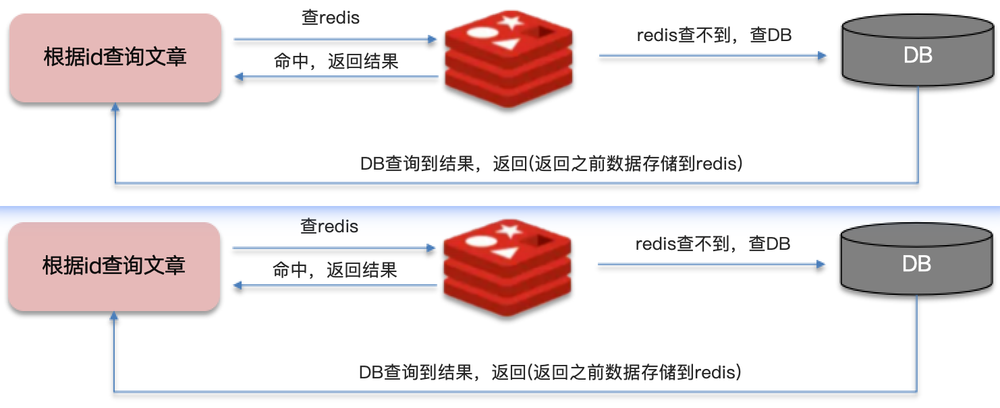

# Redis 使用场景
此部分面试题一般会结合项目来问，回答时要将知识点融入到项目场景中

## 1. 我看你做的项目中都用到了Redis，你都在哪些场景下用到了Redis？
> Tips：此问题目的一是验证你项目的真实性，二是作为深入提问的切入点
- 缓存（缓存三兄弟（穿透、击穿、雪崩）、双写一致、持久化、数据过期策略，数据淘汰策略）
- 分布式锁（setnx、redisson ）
- 消息队列、延迟队列（何种数据类型，如何实现）
- 分布式计数器（计数器类型，如何实现）

## 2. 什么是缓存穿透？怎么解决？
- 缓存穿透：查询一个不存在的数据，缓存和数据库中都没有此数据，就会导致每次请求都查数据库
  
- 解决方案一：缓存空数据
- 解决方案二：布隆过滤器
  - 布隆过滤器主要用于检索一个数据是否在一个集合中，我们当时使用的是Redisson实现的布隆过滤器。
  - 它的底层主要是先去初始化一个比较大的数组，里面存放的二进制0和1。一开始都是0，当一个key来了之后，经过三次hash计算，模数组长度找到找到对应下标，然后将该位置改为1，这三个位置的1表明key存在。
  
  
  
  - 优点：内存占用较少，没有多余key
  - 缺点：实现复杂，存在误判
    - 会产生误判，设置一个误判率，比如%5。
    - 数组越小误判率就越大，数组越大误判率就越小，但是同时带来了更多的内存消耗。

## 3. 什么是缓存击穿？怎么解决？
- 缓存击穿：给某一个key设置了过期时间，当key过期的时候，恰好这时间点对这个key有大量的并发请求过来，这些并发的请求可能会瞬间把DB压垮

- 解决方案一：互斥锁
- 解决方案二：逻辑过期

> Tips：回答示例
> 1. 缓存击穿的意思是对于设置了过期时间的key，缓存在某个时间点过期的时候，恰好这个时间点对这个key有大量的并发请求过来，这些请求发现这个key的缓存已经过期，就都会从数据库查询数据并同时缓存到Redis中，这个时候大并发请求可能会瞬间把DB压垮。
> 2. 解决方案有两种方式：
> + 第一种方案可以使用互斥锁，当缓存失效时，不立即去从DB中查询数据，而是先使用如Redis的setnx去设置一个互斥锁，当操作成功后返回时再从DB中查询数据并回设缓存，否则就重试get缓存的操作。
> + 第二种方案可以设置当前key逻辑过期，在设置key的时候，设置一个过期时间字段一块存入缓存中，不给当前key设置过期时间；当查询的时候，从redis取出数据后判断时间是否过期；如果过期则在另一个线程进行数据同步，当前线程正常返回数据，此数据不是最新的
> 3. 这两种方案各有利弊，如果选择数据的强一致性，建议使用分布式锁的方案，性能上可能会有影响；如果优先考虑高可用性，可以选择key的逻辑删除，性能比较高，但是数据会存在一定的延迟。

## 4. 什么是缓存雪崩？怎么解决？
- 缓存雪崩：在同一时段大量的缓存key同时失效或者Redis服务宕机，导致大量请求到达数据库，带来巨大压力

- 解决方案：
  - 给不同的key的TTL添加随机值
  - 利用Redis集群提高服务的可用性（哨兵模式、集群模式）
  - 给缓存业务添加降级限流策略，降级可做为系统的保底策略，适用于穿透、击穿、雪崩
    （nginx、spring cloud gateway、sentinel）
  - 给业务添加多级缓存（Guava/Caffeine Cache、LocalCache、RedisCache）
> Tips：回答示例
> 1. 缓存雪崩的意思是设置缓存时采用了相同的过期时间，导致缓存在某一时间同时失效，请求全部转发到了数据库，数据库瞬时压力过大雪崩。与缓存击穿的区别：雪崩是很多个key，击穿是某一个key。
> 2. 解决方案主要是将缓存失效时间分散开，比如可以在原有的失效时间基础上增加一个随机值，比如1-5分钟间的随便值，这样每一个缓存的过期时间的重复率就会降低，很难引发一起失效的情况。

**《缓存三兄弟》**

穿透无中生有key，布隆过滤null隔离。

缓存击穿过期key，锁与非期解难题。

雪崩大量过期key，过期时间要随机。

面试必考三兄弟，可用限流来保底。

## 5. redis做为缓存，DB的数据如何与redis进行同步呢？（双写一致性）
### 5.1 分布式锁保证数据一致性
- 双写一致性：当修改了数据库的数据也要同时更新缓存的数据，缓存和数据库的数据要保持一致
- 读操作：缓存命中，直接返回；缓存未命中查询数据库，写入缓存设置超时时间，然后返回结果

- 写操作：延迟双删

- 双写一致分布式锁

- 读多写少
  - 共享锁：读锁readLock，加锁之后，其它线程可以共享读操作
  - 排他锁：独占锁writeLock，加锁之后，阻塞其它线程读写操作

```java
public Item getById(Integer id) {
    RReadWriteLock readWriteLock = redissonClient.getReadWriteLock("ITEM_READ_WRITE_LOCK");
    // 读之前加读锁，读锁的作用就是等待该lockkey释放写锁以后再读
    RLock readLock = readWriteLock.readLock();
    try {
        // 加读锁
        readLock.lock();
        System.out.println("readLock...");
        Item item = (Item) redisTemplate.opsForValue().get("item:" + id);
        if (item != null) {
            return item;
        }
        // 查询业务数据
        item = new Item(id, "苹果手机", "苹果手机", 6999.00);
        // 写入缓存
        redisTemplate.opsForValue().set("item:" + id, item);
        // 返回数据
        return item;
    } finally {
        // 解锁
        readLock.unlock();
    }
}
```
```java
public void updateById(Integer id) {
    RReadWriteLock readWriteLock = redissonClient.getReadWriteLock("ITEM_READ_WRITE_LOCK");
    // 写之前加写锁，写锁加锁成功，读锁只能等待
    RLock writeLock = readWriteLock.writeLock();
    try {
        // 加写锁
        writeLock.lock();
        System.out.println("writeLock...");
        // 更新业务数据
        Item item = new Item(id, "苹果手机", "苹果手机", 6888.00);
        try {
            Thread.sleep(10000);
        } catch (InterruptedException e) {
            e.printStackTrace();
        }
        // 删除缓存
        redisTemplate.delete("item:" + id);
    } finally {
        // 解锁
        writeLock.unlock();
    }
}
```
### 5.2 异步通知保证数据的最终一致性

- 基于Canal的异步通知

> Tip：二进制日志（BINLOG）记录了所有的 DDL（数据定义语言）语句和 DML（数据操纵语言）语句，但不包括数据查询（SELECT、SHOW）语句。

## 6. 能聊一聊Redis的持久化机制吗？
### 6.1 RDB
- RDB持久化：Redis默认的持久化方式，就是将内存中的数据保存到磁盘上，以二进制文件的形式保存，这种持久化方式比较简单，但是效率低，而且磁盘空间占用大。当Redis实例故障重启后，从磁盘读取快照文件，恢复数据。

- Redis内部有触发RDB的机制，可以在redis.conf文件中找到，格式如下：
```text
# 900秒内，如果至少有1个key被修改，则执行bgsave 
save 900 1  
save 300 10  
save 60 10000
```
- 执行原理：bgsave开始时会fork主进程得到子进程，子进程<font color=red>共享</font>主进程的内存数据。完成fork后读取内存数据并写入 RDB 文件。
  - fork采用的是copy-on-write技术：
    - 当主进程执行读操作时，访问的是共享内存
    - 当主进程执行写操作时，会拷贝一份数据，执行写操作


### 6.2 AOF
- AOF全称为Append Only File（追加文件）。Redis处理的每一个写命令都会记录在AOF文件，可以看做是命令日志文件。

- AOF默认是关闭的，需要修改redis.conf配置文件来开启AOF：
```text
# 是否开启AOF功能，默认是no
appendonly yes
# AOF文件的名称
appendfilename "appendonly.aof"
```
- AOF的命令记录的频率也可以通过redis.conf文件来配：
```text
# 表示每执行一次写命令，立即记录到AOF文件
appendfsync always 
# 写命令执行完先放入AOF缓冲区，然后表示每隔1秒将缓冲区数据写到AOF文件，是默认方案
appendfsync everysec 
# 写命令执行完先放入AOF缓冲区，由操作系统决定何时将缓冲区内容写回磁盘
appendfsync no
```
| 配置项      | 刷盘时机   | 优点   | 缺点      |
|----------|--------|------|---------|
| Always   | 同步刷盘   | 可靠性高，几乎不丢数据 | 性能影响大 |
| everysec | 每秒刷盘   | 性能适中 | 最多丢失1秒数据|
| no       | 操作系统控制 | 性能最好 | 可靠性较差，可能丢失大量数据 |
- 因为是记录命令，AOF文件会比RDB文件大的多。而且AOF会记录对同一个key的多次写操作，但只有最后一次写操作才有意义。通过执行bgrewriteaof命令，可以让AOF文件执行重写功能，用最少的命令达到相同效果。

- Redis也会在触发阈值时自动去重写AOF文件。阈值也可以在redis.conf中配置：
```text
# AOF文件比上次文件 增长超过多少百分比则触发重写
auto-aof-rewrite-percentage 100
# AOF文件体积最小多大以上才触发重写 
auto-aof-rewrite-min-size 64mb 
```
### 6.3 持久化方式对比
RDB和AOF各有自己的优缺点，如果对数据安全性要求较高，在实际开发中往往会<font color=red>结合</font>两者来使用。

| 配置项  | RDB | AOF |
|------|----|---|
| 持久化方式 | 定时对整个内存做快照 | 记录每一次执行的命令 |
| 数据完整性 | 不完整，两次备份之间会丢数据 | 相对完整，取决于刷盘策略 |
| 文件大小 | 会有压缩，文件体积小 | 记录命令，文件体积大 |
| 宕机恢复速度 | 很快 | 慢 |
| 数据恢复优先级 | 低，因为数据完整性不如AOF | 高，因为数据完整性更高 |
| 系统资源占用 | 高，大量CPU和内存消耗 | 低，主要是磁盘IO资源，但AOF重写时会占用大量CPU和内存资源 |
| 使用场景 | 可以容忍数分钟的数据丢失，追求更快的启动速度 | 对数据安全性要求较高场景 |

## 7. 假如redis的key过期之后，会立即删除吗？
- 惰性删除：设置该key过期时间后，我们不去管它，当需要该key时，我们在检查其是否过期，如果过期，我们就删掉它，反之返回该key
  - 优点 ：对CPU友好，只会在使用该key时才会进行过期检查，对于很多用不到的key不用浪费时间进行过期检查
  - 缺点 ：对内存不友好，如果一个key已经过期，但是一直没有使用，那么该key就会一直存在内存中，内存永远不会释放
- 定期删除：每隔一段时间，就对一些key进行检查，删除里面过期的key(从一定数量的数据库中取出一定数量的随机key进行检查，并删除其中的过期key)
  - 定期清理有两种模式：
    - SLOW模式是定时任务，执行频率默认为10hz，每次不超过25ms，以通过修改配置文件redis.conf 的hz 选项来调整这个次数
    - FAST模式执行频率不固定，但两次间隔不低于2ms，每次耗时不超过1ms
  - 优点：可以通过限制删除操作执行的时长和频率来减少删除操作对 CPU 的影响。另外定期删除，也能有效释放过期键占用的内存。
  - 缺点：难以确定删除操作执行的时长和频率。
  
**Redis的过期删除策略：<font color=red>惰性删除 + 定期删除</font>两种策略进行配合使用**

## 8. 假如缓存过多，内存是有限的，内存被占满了怎么办？
> 其实就是想问redis的数据淘汰策略是什么？

**数据的淘汰策略**：当Redis中的内存不够用时，此时在向Redis中添加新的key，那么Redis就会按照某一种规则将内存中的数据删除掉，这种数据的删除规则被称之为内存的淘汰策略。
- noeviction： 不淘汰任何key，但是内存满时不允许写入新数据，<font color=red>默认就是这种策略</font>。
- volatile-ttl： 对设置了TTL的key，比较key的剩余TTL值，TTL越小越先被淘汰
- allkeys-random：对全体key ，随机进行淘汰。
- volatile-random：对设置了TTL的key ，随机进行淘汰。
- allkeys-lru： 对全体key，基于LRU算法进行淘汰
- volatile-lru： 对设置了TTL的key，基于LRU算法进行淘汰
- allkeys-lfu： 对全体key，基于LFU算法进行淘汰
- volatile-lfu： 对设置了TTL的key，基于LFU算法进行淘汰
> LRU（Least Recently Used）最近最少使用。用当前时间减去最后一次访问时间，这个值越大则淘汰优先级越高。

> LFU（Least Frequently Used）最少频率使用。会统计每个key的访问频率，值越小淘汰优先级越高。

数据淘汰策略-使用建议

- 优先使用 allkeys-lru 策略。充分利用 LRU 算法的优势，把最近最常访问的数据留在缓存中。如果业务有明显的冷热数据区分，建议使用。
- 如果业务中数据访问频率差别不大，没有明显冷热数据区分，建议使用 allkeys-random，随机选择淘汰。
- 如果业务中有置顶的需求，可以使用 volatile-lru 策略，同时置顶数据不设置过期时间，这些数据就一直不被删除，会淘汰其他设置过期时间的数据。
- 如果业务中有短时高频访问的数据，可以使用 allkeys-lfu 或 volatile-lfu 策略。

## 9. redis分布式锁是如何实现的？
在redis中提供了一个命令 <font color=red>SETNX</font> (SET if not exists)。由于redis是单线程的，用了这个命令之后，只能有一个客户端对某一个key设置值。在没有过期或删除key的时候，其他客户端是不能设置这个key的
```text
# 添加锁，NX是互斥、EX是设置超时时间
SET lock value NX EX 10
# 释放锁，删除即可
DEL key
```

## 10. 那你如何控制Redis实现分布式锁的有效时长呢？
redis的SETNX指令不好控制这个问题。我们当时采用的是redis的一个框架Redisson实现的。在Redisson中需要手动加锁，并且可以控制锁的失效时间和等待时间。当锁住的一个业务还没有执行完成的时候，Redisson会引入一个看门狗机制。就是说，每隔一段时间就检查当前业务是否还持有锁。如果持有，就增加加锁的持有时间。当业务执行完成之后，需要使用释放锁就可以了。还有一个好处就是，在高并发下，一个业务有可能会执行很快。客户1持有锁的时候，客户2来了以后并不会马上被拒绝。它会自旋不断尝试获取锁。如果客户1释放之后，客户2就可以马上持有锁，性能也得到了提升。

Redisson实现的分布式锁-执行流程：


Redisson实现的分布式锁-代码实现：
```java
public void redisLock() throws InterruptedException {
    //获取锁（重入锁），执行锁的名称
    RLock lock = redissonClient.getLock("heimalock");
    try {
        //尝试获取锁，参数分别是：获取锁的最大等待时间（期间会重试），锁自动释放时间，时间单位
        //boolean isLock = lock.tryLock(10, 30, TimeUnit.SECONDS);
        boolean isLock = lock.tryLock(10, TimeUnit.SECONDS);
        //判断是否获取成功
        if (isLock) {
            System.out.println("执行业务...");
        }
    } finally {
        //释放锁
        lock.unlock();
    }
}
```

## 11. Redisson实现的分布式锁是可重入的吗？
是可以重入的。这样做是为了避免死锁的产生。这个重入其实在内部就是判断是否是当前线程持有的锁，如果是当前线程持有的锁就会计数，如果释放锁就会在计数上减一。在存储数据的时候采用的hash结构，大key可以按照自己的业务进行定制，其中小key是当前线程的唯一标识，value是当前线程重入的次数。

## 12. Redisson实现的分布式锁能解决主从一致性的问题吗？
- 这个是不能的。比如，当线程1加锁成功后，master节点数据会异步复制到slave节点，此时如果当前持有Redis锁的master节点宕机，slave节点被提升为新的master节点，假如现在来了一个线程2，再次加锁，会在新的master节点上加锁成功，这个时候就会出现两个节点同时持有一把锁的问题。
- 我们可以利用Redisson提供的红锁来解决这个问题，它的主要作用是，不能只在一个Redis实例上创建锁，应该是在多个Redis实例上创建锁，并且要求在大多数Redis节点上都成功创建锁，红锁中要求是Redis的节点数量要过半。这样就能避免线程1加锁成功后master节点宕机导致线程2成功加锁到新的master节点上的问题了。
- 但是，如果使用了<font color=red>红锁</font>，因为需要同时在多个节点上都添加锁，<font color=red>性能就变得非常低</font>，并且运维维护成本也非常高，所以，我们一般在项目中也不会直接使用红锁，并且官方也暂时废弃了这个红锁。
- 如果业务中非要<font color=red>保证数据的强一致性</font>，建议采用<font color=red>zookeeper</font>实现的分布式锁

## 13. Redis的集群方案有哪些？
### 13.1 主从复制
单节点Redis的并发能力是有上限的，要进一步提高Redis的并发能力，就需要搭建主从集群，实现读写分离


主从<font color=color>全量复制</font>： 
> <font color=red>Replication Id</font>：简称replid，是数据集的标记，id一致则说明是同一数据集。每一个master都有唯一的replid，slave则会继承master节点的replid

> <font color=red>offset</font>：偏移量，随着记录在repl_baklog中的数据增多而逐渐增大。slave完成同步时也会记录当前同步的offset。如果slave的offset小于master的offset，说明slave数据落后于master，需要更新。


主从<font color=red>增量同步</font>(slave重启或后期数据变化)：


### 13.2 哨兵模式
Redis提供了哨兵（Sentinel）机制来实现主从集群的自动故障恢复
- **监控**：Sentinel 会不断检查您的master和slave是否按预期工作
- **自动故障恢复**：如果master故障，Sentinel会将一个slave提升为master。当故障实例恢复后也以新的master为主
- **通知**：Sentinel充当Redis客户端的服务发现来源，当集群发生故障转移时，会将最新信息推送给Redis的客户端


Sentinel基于心跳机制监测服务状态，<font color=red>每隔1秒</font>向集群的每个实例发送ping命令：
- 主观下线：如果某sentinel节点发现某实例未在规定时间响应，则认为该实例**主观下线**。
- 客观下线：若超过指定数量（quorum）的sentinel都认为该实例主观下线，则该实例**客观下线**。quorum值最好超过Sentinel实例数量的一半。


**哨兵选主规则**
- 首先判断主与从节点断开时间长短，如超过指定值就排除该从节点
- 然后判断从节点的slave-priority值，越小优先级越高
- <font color=red>如果slave-prority一样，则判断slave节点的offset值，越大优先级越高</font>
- 最后是判断slave节点的运行id大小，越小优先级越高。

**Redis哨兵模式脑裂**
```text
redis中有两个配置参数：
min-replicas-to-write 1   表示最少的salve节点为1个
min-replicas-max-lag 5  表示数据复制和同步的延迟不能超过5秒
```


### 13.3 分片集群
主从和哨兵可以解决高可用、高并发读的问题。但是依然有两个问题没有解决：
- 海量数据存储问题
- 高并发写的问题

使用分片集群可以解决上述问题，分片集群特征：
- 集群中有多个master，每个master保存不同数据
- 每个master都可以有多个slave节点
- master之间通过ping监测彼此健康状态
- 客户端请求可以访问集群任意节点，最终都会被转发到正确节点


**分片集群结构-数据读写**

Redis 分片集群引入了哈希槽的概念，Redis 集群有 16384 个哈希槽，每个 key通过 CRC16 校验后对 16384 取模来决定放置哪个槽，集群的每个节点负责一部分 hash 槽。


## 14. Redis是单线程，为什么还那么快？
- Redis是纯内存操作，执行速度非常快
- 采用单线程，避免不必要的上下文切换可竞争条件，多线程还要考虑线程安全问题
- 使用I/O多路复用模型，非阻塞IO

## 15. 能解释一下I/O多路复用模型吗？
> Redis是纯内存操作，执行速度非常快，它的性能瓶颈是<font color=red>网络延迟</font>而不是执行速度， I/O多路复用模型主要就是实现了高效的网络请求

<font color=red>**用户空间和内核空间**</font>
- Linux系统中一个进程使用的内存情况划分两部分：内核空间、用户空间
- **用户空间**只能执行受限的命令（Ring3），而且不能直接调用系统资源，必须通过内核提供的接口来访问
- **内核空间**可以执行特权命令（Ring0），调用一切系统资源

Linux系统为了提高IO效率，会在用户空间和内核空间都加入缓冲区：
- 写数据时，要把用户缓冲数据拷贝到内核缓冲区，然后写入设备
- 读数据时，要从设备读取数据到内核缓冲区，然后拷贝到用户缓冲区


<font color=red>**Redis网络模型：**</font>

Redis通过IO多路复用来提高网络性能，并且支持各种不同的多路复用实现，并且将这些实现进行封装， 提供了统一的高性能事件库


> I/O多路复用是指利用单个线程来同时监听多个Socket，并且在某个Socket可读、可写时得到通知，从而避免无效的等待，充分利用CPU资源。目前的I/O多路复用都是采用的epoll模式实现，它会在通知用户进程Socket就绪的同时，把已就绪的Socket写入用户空间，不需要挨个遍历Socket来判断是否就绪，提升了性能。
>
> 其中Redis的网络模型就是使用I/O多路复用结合事件的处理器来应对多个Socket请求，比如，提供了连接应答处理器、命令回复处理器，命令请求处理器；
> 
> 在Redis6.0之后，为了提升更好的性能，在命令回复处理器使用了多线程来处理回复事件，在命令请求处理器中，将命令的转换使用了多线程，增加命令转换速度，在命令执行的时候，依然是单线程


